# :jigsaw: Desafio - Sprint 10

:calendar: 17/02 à 05/03/2025

 

## :dart: Objetivo

 O desafio dessa sprint é praticar a combinação de conhecimentos vistos no Programa de Bolsas, fazendo um mix de tudo que já foi dito.

 

## :rocket: Desafio Final - Filmes e Séries

O Desafio de Filmes e Séries está dividido em 5 entregas.                           
Trata-se de um desafio para construção de um Data Lake, com as estapas de Ingestão, Armazenamento, Processamento e Consumo.
  

## :heavy_check_mark: Etapas - Entrega 5 - Final

Após passarmos por toda a experiência de montar um Data Lake num modo totalmente "codado", chegou a hora de enfim, visualizarmos nosso trabalho pronto.

Particularmente, talvez por já ser formada em produção multimídia - que envolve aprendizado nas áreas de Design Gráfico, Produção de Vídeo e Web Design - tenho prazer em criar algo esteticamente bonito, útil e, principalmente, educativo. Apesar das dificuldade com a limitação do QuickSight, consegui chegar ao objetivo desse desafio que é a entrega do dashboard.

 

Obs.: Todas as evidências deste desafio encontram-se no diretório [evidências](../evidencias/evid_desafio/).

 

* [:ghost: Tema da Squad 6 - Terror e Mistério](#-tema-da-squad-6---terror-e-mistério)
* [:compass: Trajetória ](#-trajetória)
    - [Sprint 06](#sprint-6)
    - [Sprint 07](#sprint-7)
    - [Sprint 08](#sprint-8)
    - [Sprint 09](#sprint-9)
    - [Sprint 10](#sprint-10)
* [:angel: Análise: Infância nas Sombras - Quando o Medo tem Rosto de Criança :japanese_ogre:](#-análise---infância-nas-sombras---quando-o-medo-tem-rosto-de-criança)
    - [:world_map: Países com Mais Produções - Filled Map](#gráfico-mapa-preenchido---países-com-mais-produções)
    - [:bar_chart: Evolução ao Longo dos Anos - Vertical Bar Chart](#gráfico-de-barras-verticais---evolução-ao-longo-dos-anos)
    - [:doughnut: Distribuição dos Títulos - Donut Chart](#gráfico-de-rosca---distribuição-dos-títulos)
    - [:cloud: Principais Temas em Filmes de Terror - Word Cloud](#nuvem-de-palavras---principais-temas-em-filmes-de-terror)
    - [:pizza: Crianças x Gênero - Pie Chart](#gráfico-de-pizza---crianças-x-gênero)
    - [:chart_with_upwards_trend: O Crescimento de Filmes e Séries com Crianças - Line Chart](#gráfico-de-linhas---o-crescimento-de-filmes-e-séries-com-crianças)
    - [:popcorn: Gêneros Relacionados ao Terror: Quais são os mais Frequentes? - Tree Map](#mapa-de-árvore---gêneros-relacionados-ao-terror-quais-são-os-mais-frequentes)
    - :tv: [Idade das Crianças x Tipo de Produção - Box Plot](#gráfico-de-caixa---idades-das-crianças-x-tipo-de-produção)
    - [:trophy: Crianças com Maior Número de Produções no Gênero - Vertical Stacked Bar Chart](#gráfico-de-barras-empilhadas---crianças-com-maior-número-de-produções-no-gênero)
    - [:child: Idade Média das Crianças - KPI](#principal-indicador-de-desempenho---idade-média-das-crianças)
    - [:performing_arts: FILMES - Relação de Crianças Elencadas em Gêneros de Terror - Table](#tabela---filmes---relação-de-crianças-elencadas-em-gêneros-de-terror)
    - [:crown: Popularidade - Radar Chart](#gráfico-de-radar---popularidade)
    - [:fire: Palavras-chave ao Longo das Décadas - Heat Map](#mapa-de-calor---palavras-chave-ao-longo-das-décadas)
    - [:star: Popularidade por Idade - Scatter Plot](#gráfico-de-dispersão---popularidade-por-idade)
    - [:stop_sign: Classificação Indicativa x Idade Média das Crianças](#gráfico-de-caixa---classificação-indicativa-x-idade-média-das-crianças)

* [:nerd_face: Técnicamente falando...](#-técnicamente-falando)
* [:thinking: Ah, Rochelly, mas e agora? O que você quer ser?](#-ah-rochelly-mas-e-agora-o-que-você-quer-ser)

 

## :ghost: Tema da Squad 6 - Terror e Mistério

Passei muito tempo pensando no que gostaria de desenvolver para a criação do dashboard, até que me veio a ideia de trabalhar com informações de crianças nesse gênero, confesso, completamente influenciada pela presença do meu filho que completou 1 ano e 11 meses neste última dia 08.

Quando me tornei mãe, inevitavelmente, o universo infantil passou a ser realidade no dia-a-dia. Não só pelo bebê, mas por mim mesma, pois acabo resgatando memórias de quando eu própria era criança.

Uma das coisas que me marcaram de pequena, era quando começava algum filme de terror e minha mãe mandava sair do ambiente. Então fui crescendo e quando cheguei naquela fase de pré-adolescente que vai na casa das amigas assistir filmes (ainda existia locadora, rs), sempre alugávamos gêneros de terror. Alguns dos que mais me recordo nesta época foram "O Navio Fantasma", "O Chamado", "13 Fantasmas", "Os Outros". A 1ª temporada da série "Supernatural" também me acompanhou e esse, assisti com minha mãe. Lembro muito bem que passava no SBT aos domingos de noite e era o único dia pré aula que ela me deixava dormir depois das 22h30. Fiquei traumatizada quando chegou no dia que seria a exibição do último capítulo e o SBT mudou a grade e no lugar entrou "Californication". Não assisti o este episódio até hoje, rs.

Apesar de ficar apavorada e muitas vezes precisar assistir com uma almofada pra esconder o rosto (.... até hoje), sempre foi um gênero, de certa forma, muito atraente (mesmo que depois precisasse levar algum gato comigo no banheiro de madrugada para fazer companhia).

Enfim, trabalhar com esse gênero e com crianças fez meu cérebro eclodir em ideias. Porém, ao mesmo tempo, foram ideias demais que me soterraram e fez com que me perdesse diante de tantas possibilidades.

É impossível falar sobre o desenvolvimento deste Data Lake sem mencionar a agilidade de raciocínio e facilidade no aprendizado que sempre me acompanhou a vida inteira, no entanto desde a gravidez, foi por água abaixo. Me deparei muitas vezes querendo desistir do PB por essa dificuldade que tive de acompanhar tudo - o PB, a faculdade, a maternidade. Um misto de euforia e esperança quando as coisas tomavam forma, e melancolia, raiva quando aparecia um ``failed`` ou até quando rodava mas na hora de conferir não foi bem assim. A síndrome do impostor me acompanhou bem de perto, mas foi justamente a presença dessa insegurança, que me vinha a consciência para lembrar que nesse recomeço, eu sabia que não seria fácil, mas foi a maneira encontrada para ter mais qualidade de vida física e mental, concluindo o objetivo de realizar a transição de carreira.

 

## :compass: Trajetória

### Sprint 6

 Na ``Sprint 6`` fomos apresentados ao ``DESAFIO FINAL`` e aos Serviços práticos da AWS, depois de bastante teoria. Neste momento, analisamos os arquivos ``CSV`` disponibilizados pela Compass para termos um primeiro contato com os dados que teríamos para trabalhar. Foi usado o Docker para fazer a ingestão desses dados locais num bucket no S3. Deu-se o início da ``Camada RAW``.

 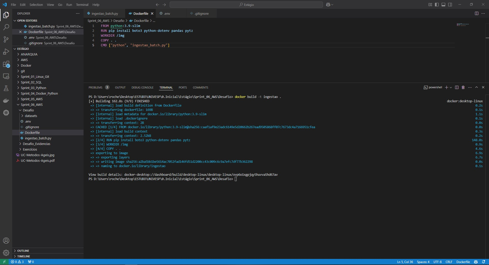                       
 _*Evidência s6_1 - Ingestão de arquivos ``csv`` local no S3 através de container do ``Docker``. Construção da imagem "tageada" como ingestao através do comando ``docker build -t ingestao .``.*_

 

 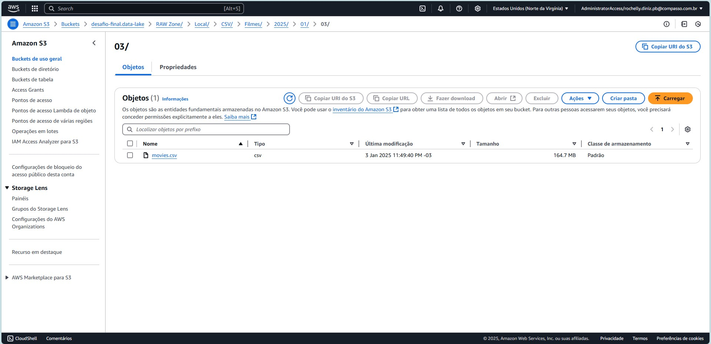                       
 _*Evidência s6_2 - Evidência do arquivo salvo por caminho de diretórios específicos confome solicitado.*_
 
 

### Sprint 7

Na ``Sprint 7`` conhecemos o The Movie Database - TMDb, que nos abriu as portas para as milhares de possibilidades. Nesse momento, comecei a elaborar uma trilha, mas ao final da sprint, com dificuldade para entender o funcionamento do Spark e da API, fiz a entrega da forma como achei que estava certo. Ainda estávamos populando a ``RAW Zone``. Neste momento, usamos o Lambda, com inclusão de camada de instalação de bibliotecas das quais não estavam nativas no serviço e utilização de API para coletar os dados diretamente do servidor do TMDb e salvar em formato ``Json`` no bucket.

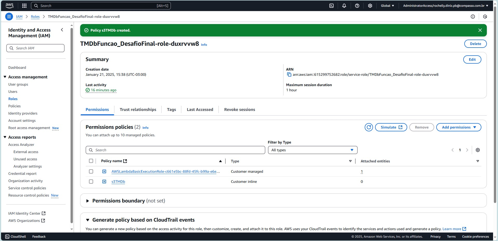                       

_*Evidência s7_1 - Criação de Role ``TMDbFuncao_DesafioFinal`` no IAM para permissão de acesso de leitura e gravação nos serviçoes necessários para criação do Data Lake.*_

 

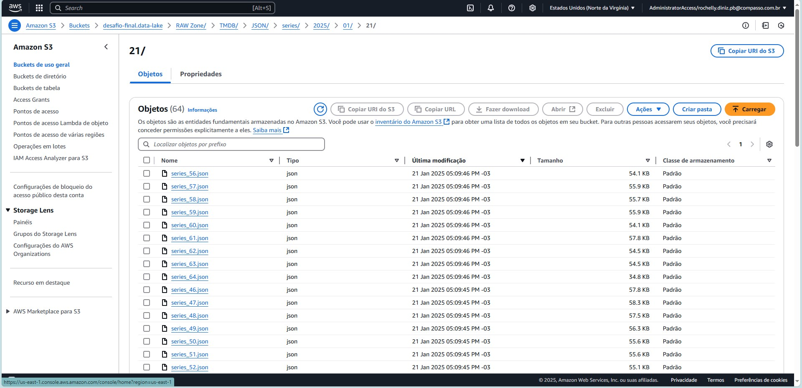                       
_*Evidência s7_2 - Evidência do arquivo ``Json`` salvo por caminho de diretórios específicos confome solicitado.*_

 

### Sprint 8

A ``Sprint 8`` foi elaborada para tratamento e manipulação dos dados da camada RAW com salvamento em formato ``Parquet`` na camada Trusted utilizando jobs do AWS Glue. Foi neste momento que percebi o tamanho do B.O. que estava se formando, e percebi que os dados que tinha disponível até então, não serviriam para minha análise. Ainda assim, entreguei a "base" da Trusted e iniciei o recálculo da rota.

 

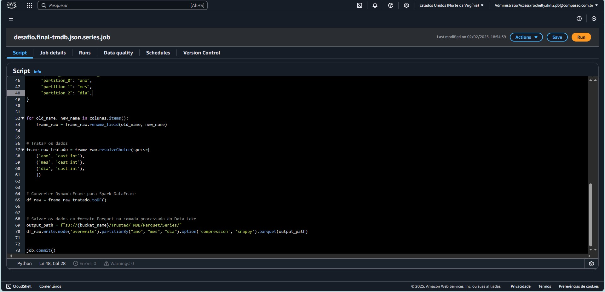                  
_*Evidência s8_1 - Tela do job ``series-tmdb``, evidenciando o bloco de correção dos tipos de dados e salvamento dos dados particionados por ``ano``,``mes``,``dia``.*_

 

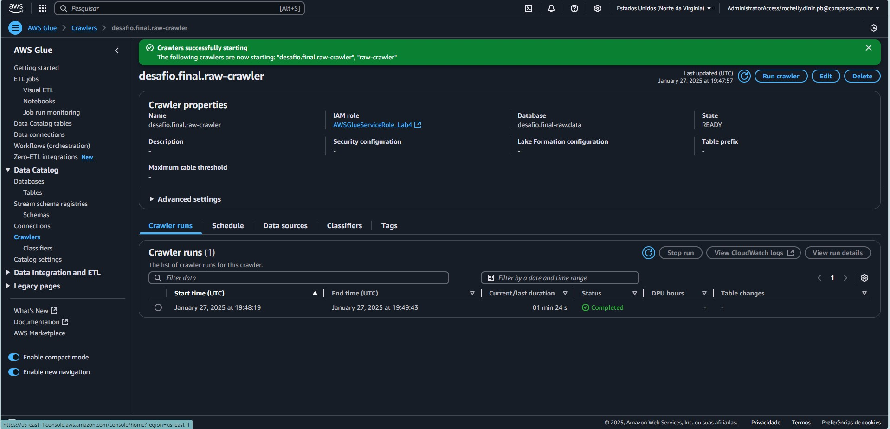                  

_*Evidência s8_2 - Exemplo de ``Crawler`` criado com suas configurações determinadas.*_

 

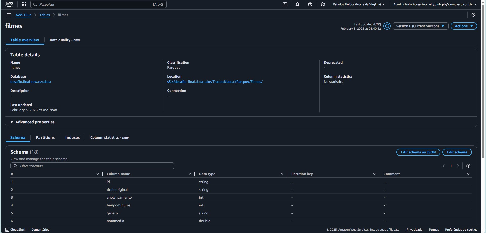                  

_*Evidência s8_3 - Detalhes do Schema ``filmes`` criado na Database ``desafio.final-raw.csv.data``.*_

 

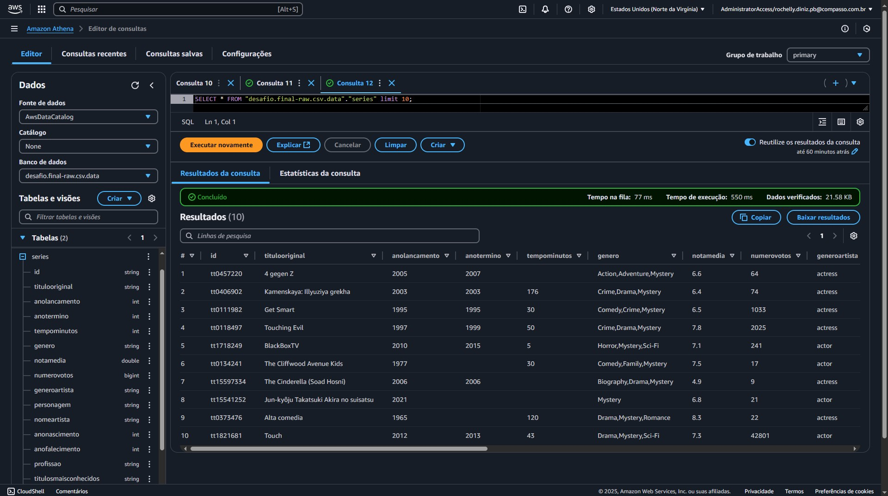                  

_*Evidência s8_4 - Tabela ``series.'desafio.final-raw.csv.data'`` criada com sucesso.*_                       
Criada com sucesso? kkkk Tadinha, tão inocente.

 

### Sprint 9

Na ``Sprint 9`` o "leite derramou" e mesmo não adiantando, chorei bastante sobre ele. Não consegui entregar a etapa do desafio pois estavam pendentes todas as outras anteriores. E neste momento, não tinha mais como "apenas" fazer uma entrega, já que eu precisava de todos os dados para realizar a modelagem dimensional e preparar os jobs para gerar a camada Refined. E foram MUITOS endpoints com MUITOS dados.

Devido minha análise tratar de um assunto muito específico, mas com abrangência mundial, não encontrei uma forma de "reduzir" o processo, logo, todas as funções testadas e jobs rodados tomaram muito tempo.

Passei quase 2 meses arrumando e testando a camada trusted pelo Google Colab e pelo Glue para chegar neste momento. Fiz a modelagem dimensional que resultou no schema abaixo....

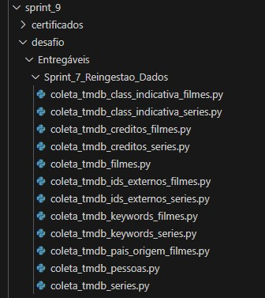                   
_*Evidência s9_1 - Visão do meu VSCode com as coletas de endpoints realizadas pelo Lambda.*_

 

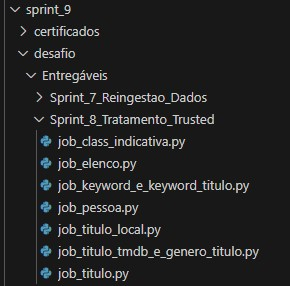                   
_*Evidência s9_2 - Visão do meu VSCode com os jobs realizados no Glue para criação da camada Trusted.*_

 

                   
_*Evidência s9_3 - Visão do meu VSCode com os jobs para criação da camada Refined e arquivo com as views processadas no Athena.*_

 

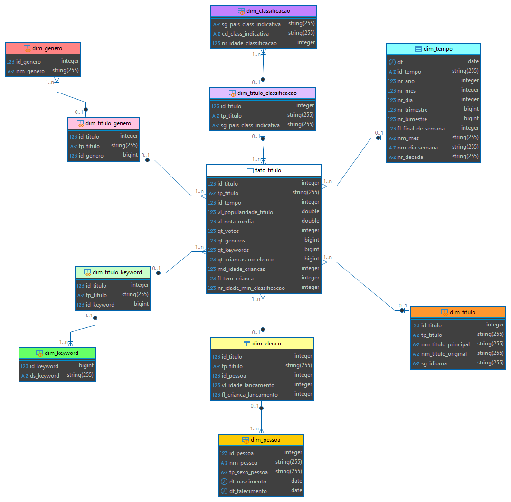                   
_*Evidência s9_1 - Modelagem realizada no DBeaver.*_                
E adivinha, só! Tive que refazer depois.

 

 

### Sprint 10

Na ``Sprint 10``, teoricamente com toda a base de dados pronta para criar um ``Dashboard``, tivemos o primeiro contato com o QuickSight. Ferramenta para análise de dados da AWS que é ``EXTREMAMENTE`` difícil de manipulação devido suas limitações. E foi começando a montar meu dashboard que comecei a notar a falta de UMA PESSOA que foi minha referência de busca no TMDb. Justamente, a Heather O' Rourke de "Poltergeist: O Fenômeno" não estava presente no gráfico onde estão elencadas as crianças por ordem crescente de idade. Ela que esteve presente em quase todos os READMEs dos desafios, que decorei o código no TMDb, e que só não aparece em comentários dos vídeos, porque precisei cortar o trecho para não ultrapassar o tempo limite.
Pois é... ontem, 09 de março, percebi que minha base estava TOTALMENTE incompleta. Ao solicitar que fossem feitas as ingestões dos filmes pelos gêneros de Terror, Mistério e Thriller (este foi agregado por fazer parte dos outros dois), ao invés de utilizar ``|`` para selecionar os filmes, utilizei ``&``. E então, tudo foi refeito, mais uma vez.

<!--
 

## :angel: Análise - "Infância nas Sombras - Quando o Medo tem Rosto de Criança" :japanese_ogre:

Desde o início, quando comecei a pensar sobre o tema, minha mentalidade mudou quanto a este assunto. E justamente a questão que mais precisaria ser respondida, neste modelo não foi possível uma resposta de fato.

> Quais os impactos psicológicos podem ser causados ao expôr atores crianças (até 12 anos de idade) para contracenar em produções dos gêneros de Terror? 

Veja bem, estamos falando de um rol de gêneros de filmes e séries que em sua grande maioria não são apropriados nem para adolescentes, para crianças menos ainda. Por que, então, produzir estes títulos que podem causar traumas aos pequenos, principalmente se, em geral, o intuito dessas produções é de entreter adultos?

Toda a análise foi baseada em filmes dos gênero de terror, mistério e thriller para os filmes e apenas mistério para as séries, devido os outros gêneros não fazerem parte do catálogo para este tipo de produção.

  

#### :world_map: Gráfico Mapa Preenchido - Países com Mais Produções
Distribuição global da quantidade títulos produzidos estrelados por crianças.

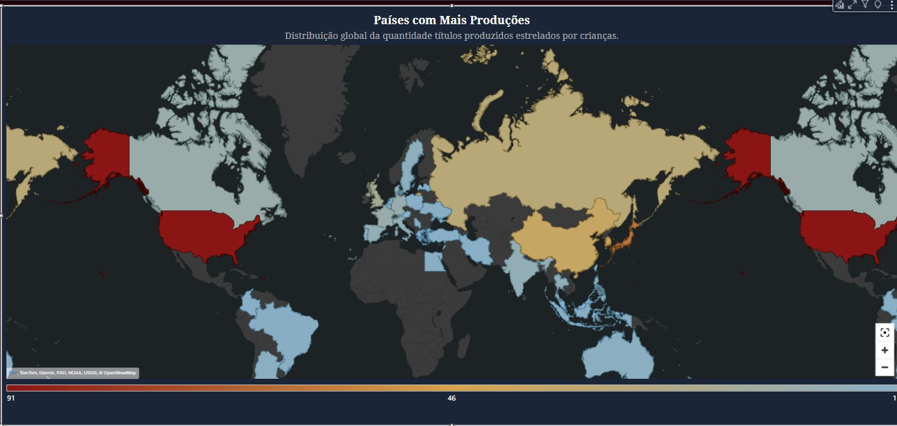
_*Evidência 1 - Gráfico que cruza as informações de país de origem ``sg_pais_origem`` com a quantidade de títulos produzidos ``id_titulo (contagem de distintos)``. Resultados: Países com a cor azul são os que menos produziram (EX: BR), os amarelos intermediários (EX: RU) e Vermelhos os que mais produziram (EX: EUA). Resultados: Como esperado, a quantidade de títulos foi aumentando com o passar dos anos, apesar de em alguns anos da década de 2010, houve variação*_

 

#### :bar_chart: Gráfico de Barras Verticais - Evolução ao Longo dos Anos
Quantidade de títulos lançados por ano com crianças no elenco principal.

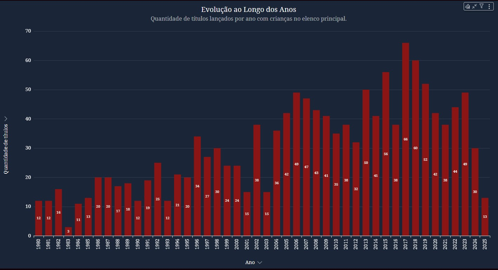
_*Evidência 2 - Gráfico que cruza as informações de país de origem ``sg_pais_origem`` com a quantidade de títulos produzidos ``id_titulo (contagem de distintos)``.*_

 

#### :doughnut: Gráfico de Rosca - Distribuição dos Títulos
Comparação da quantidade de títulos entre filmes e séries com crianças no elenco.

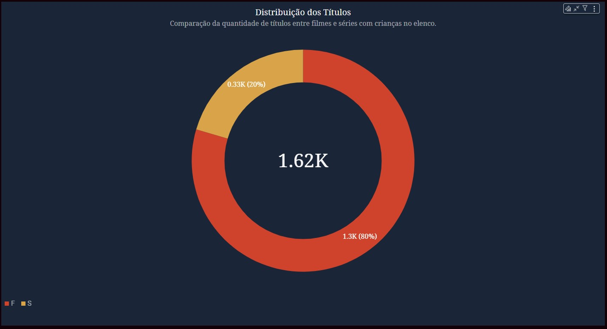
_*Evidência 3 - Gráfico que relaciona o tipo de produção (Filme ou Série) ``tp_titulo`` com a quantidade de títulos produzidos ``id_titulo (contagem de distintos)``.*_

 

#### :cloud: Nuvem de Palavras - Principais Temas em Filmes de Terror
Palavras-chave mais frequentes em produções de Terror, Mistério e Thriller estreladas por crianças.

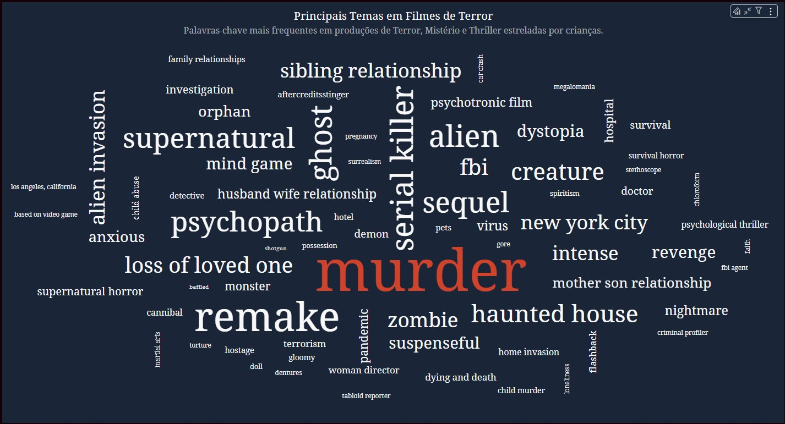
_*Evidência 4 - A nuvem de palavras faz a contagem das palavras-chave ``ds_keyword`` de cada título e mostra com tamanhos variados a depender da quantidade de títulos relacionado a ele.*_

 

#### :pizza: Gráfico de Pizza - Crianças x Gênero
Distribuição de crianças no elenco principal por sexo.

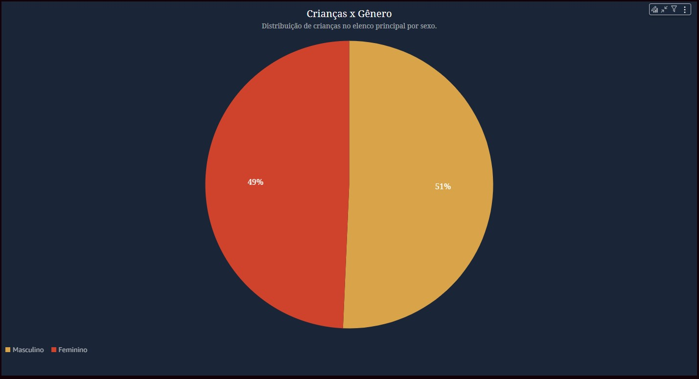
_*Evidência 5 - Relação entre o sexo das crianças ``tp_sexo``, que estão presentes nesta análise. Respostas: Neste caso os valores foram bem distribuídos, sendo 49% de crianças do sexo feminino e 51% do gênero feminino.*_

 

#### :chart_with_upwards_trend: Gráfico de Linhas - O Crescimento de Filmes e Séries com Crianças
Tendência do número de títulos lançados ao longo das décadas, comparando a evolução entre filmes e séries do gênero.

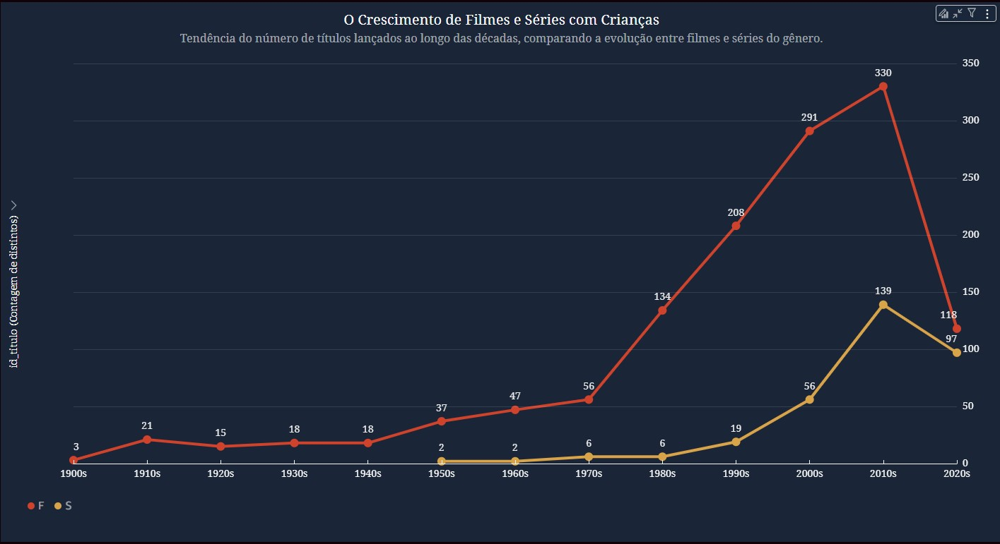
_*Evidência 5 - Período dividido por décadas ``vl_decada_lancamento``, evidenciando o crescimento nas quantidades de produções lançadas ``id_titulo (Constagem de distintos)`` e separados por tipo de produção. Respostas: A produção tanto de filmes quanto de séries cresceu exponencialmente no decorrer das décadas. Nota-se que houve muitos mais filmes do que séries e que na década de 2020, tivemos uma queda abrupta que podemos considerar, primeiramente pela questão de ainda estarmos no meio do período, porém também, a pandemia de SARS-Cov que "congelou" o mundo por inteiro.*_

 

#### :popcorn: Mapa de Árvore - Gêneros Relacionados ao Terror: Quais São os Mais Frequentes?
Mapa de árvore mostrando os gêneros mais comuns em títulos que possuem elementos de Terror, Mistério ou Thriller.

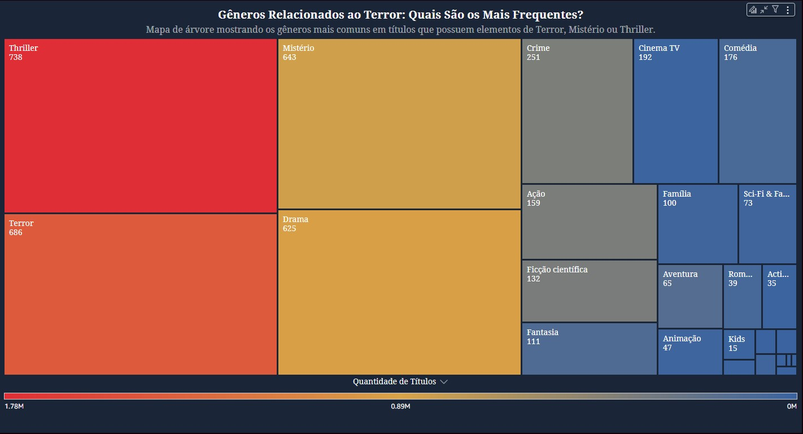
_*Evidência 7 - Os gêneros foram agrupados ``nm_genero`` e quantificados ``id_titulo``, para visualizar os demais "sub-gêneros" que acompanham os principais desta análise. Respostas: Drama exerce peso tão grande quanto os gêneros principais, seguido após uma lacuna considerável, os gêneros de Crime, Ação, Ficção Científica etc.*_

 

#### :tv: Gráfico de Caixa - Idades das Crianças x Tipo de Produção
Comparação da idade das crianças protagonistas no momento do lançamento, analisando diferenças entre filmes e séries.

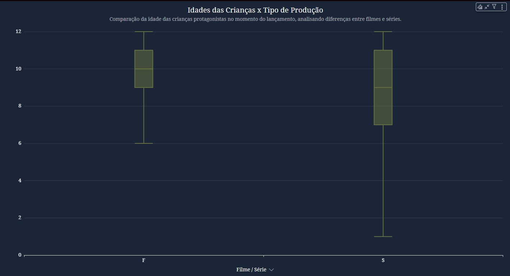
_*Evidência 8 - Aqui foi feito uma análise sobre a variação de idade sobre os tipos de produção. Respostas: *Filmes* - Idade mais nova encontrada foi 05 ano, mais velha foi 12 anos e a mediana foi 10 anos, no entanto, o 1º e o 3º quartil mostra que a maior parte das crianças são mais velhas pelo resultado de 09 e 12 anos. *Séries* - Idade mais nova encontrada foi 01 ano, mais velha foi 12 anos e a mediana foi 09 anos, no entanto, nesta situação, o 1º e 3º quartil mostram que há uma distribuição um pouco maior entre as idades pelo resultado de 07 e 11 anos.*_

 

#### :trophy: Gráfico de Barras empilhadas - Crianças com Maior Número de Produções no Gênero
Distribuição do número de participações em produções.

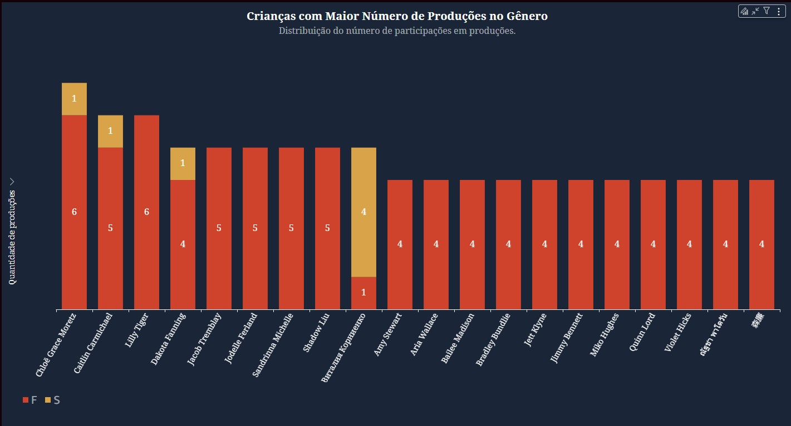
_*Evidência 9 - Este gráfico informa as crianças que mais estiveram em elencos principais nos gêneros principais ainda enquanto pertencentes a faixa etárea infantil. Resultados: A atriz Chloë Grace Moretz, até 12 anos, esteve presente em 6 filmes e 1 série, totalizando 07 priduções.*_

 

### :child: Principal indicador de Desempenho - Idade Média das Crianças
Média da idade das crianças do elenco principal na data em que as produções foram lançadas.                 

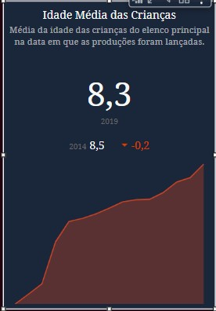                                                   

_*Evidência 10 - Este KPI evidencia que em dentre todas as produções de todo o período disponível (1900-2025), a média de idade foi de 8,3 anos (2019), tendo uma ligeira diminuição (-0,2) comparado ao ano de 2014 (8,5 anos).*_

 

### :performing_arts: Tabela - FILMES - Relação de Crianças Elencadas em gêneros de Terror
Média da idade das crianças do elenco principal na data em que as produções foram lançadas.                 

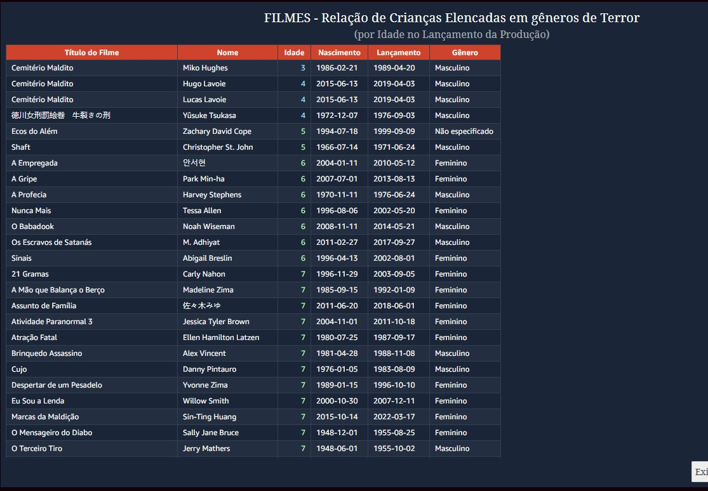                                                   

_*Evidência 11 - Tabela que mostra quais filmes tiveram as crianças no elenco, ordenadas pela idade em ordem crescente. É possível verificar rapidamente que um mesmo filme, sendo um deles possivelmente um remake ``Cemitério Maldito (1989) e (2019)`` elencou 3 crianças muito novas para estrelarem o título.*_

 

### :crown: Gráfico de Radar - Popularidade
 Medição de Popularidade, Participação e Avaliações em Filmes e Séries                 

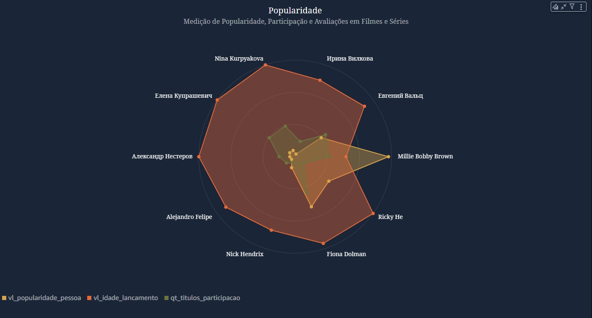                                                   

_*Evidência 12 - Gráfico que traz 3 valores (``vl_popularidade_pessoa (Máx), vl_idade_lancamento (Média) e qt_titulos_participacao (Contagem de Distintos)``). Cada ponto no gráfico corresponde a um ator, e suas métricas são exibidas como uma combinação dessas três variáveis. A distribuição das linhas ao redor do gráfico ajuda a visualizar as diferenças entre os atores, facilitando a comparação. Respostas: Por exemplo, Millie Bobby Brown está no centro de várias linhas e tem uma popularidade alta (linha laranja), enquanto outros atores, como Ricky He e Fiona Dolman, podem mostrar perfis diferentes de popularidade e participação.*_

 

### :fire: Mapa de Calor - Palavras-Chave ao Longo das Décadas
Análise das _keywords_ mais frequentes em títulos dos gêneros protagonizados por crianças ao longo das décadas

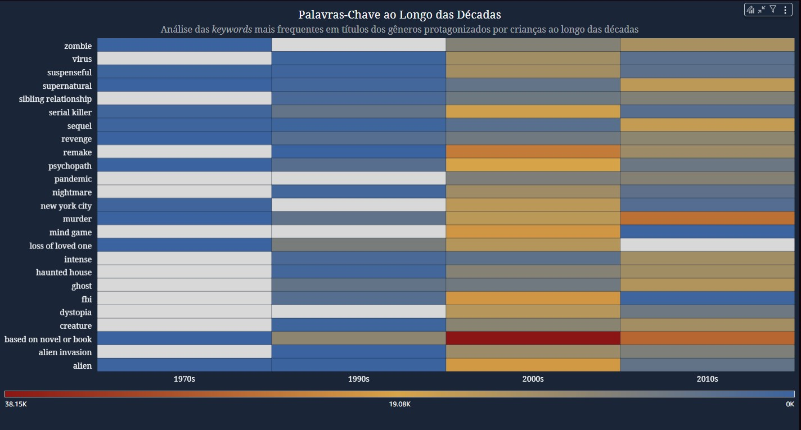                                                   

_*Evidência 13 - O comprimento de cada barra indica a frequência relativa da palavra-chave em cada década, e as cores ajudam a distinguir os diferentes períodos de tempo. As palavras-chave com barras mais longas indicam um maior uso nos títulos dessa década. Esse gráfico permite perceber como as temáticas e tendências nos filmes e séries estrelados por crianças evoluíram ao longo do tempo, com destaque para temas como suspense, terror e elementos sobrenaturais. Respostas: ``Murder`` sempre esteve presente, mas no decorrer das décadas, foi ganhando mais força.*_

 

### :star: Gráfico de Dispersão - Popularidade por Idade
Distribuição com destaque para gênero e quantidade de produções.   

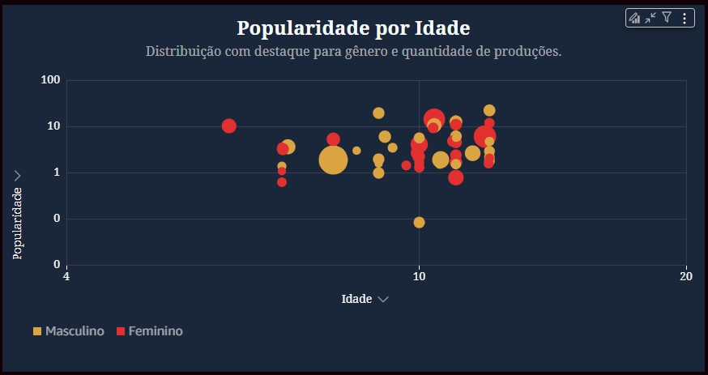                                                   

_*Evidência 14 - O gráfico revela como a popularidade está distribuída entre diferentes idades, com destaque para a diferença entre os gêneros e a quantidade de títulos estrelados. É possível observar se existe algum padrão, como uma maior popularidade entre as faixas etárias mais jovens ou se um gênero tem mais destaque em produções. Neste caso ele mostra a relação entre sua popularidade, idade e quantidade de produções em que participaram. Aqui cada ponto é uma criança.*_

 

### :stop_sign: Gráfico de Caixa - Classificação Indicativa x Idade Média das Crianças
Variação das classificações indicativas das produções, destacando a distribuição das restrições por idade.

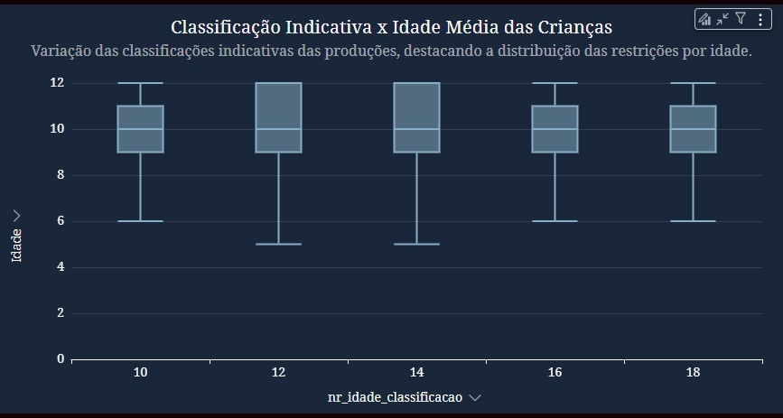                                                   

_*Evidência 15 - Chegamos ao ponto em que podemos verificar que, classificações indicativas mais baixas (10 e 12) tendem a ter idades médias entre 6 e 10 anos, indicando que as produções com essas classificações geralmente envolvem crianças mais novas (talvez envolvendo títulos infantis, como Scooby Doo) e, nas classificações indicativas mais altas (14, 16, 18), as idades médias tendem a ser mais altas, sugerindo que as produções têm protagonistas com idades mais próximas de 12 a 14 anos. Ainda assim, percebe-se que não há diferença discrepante quanto à idade em geral, independente da classificação ser mais alta, logo, mais "pesada".*_

 

## :nerd_face: Técnicamente falando......
Para trazer todas realizar esta análise foram carregadas mais de 586M de linhas no QuickSight, o que levou aproximadamente 4,5 horas para concluir.

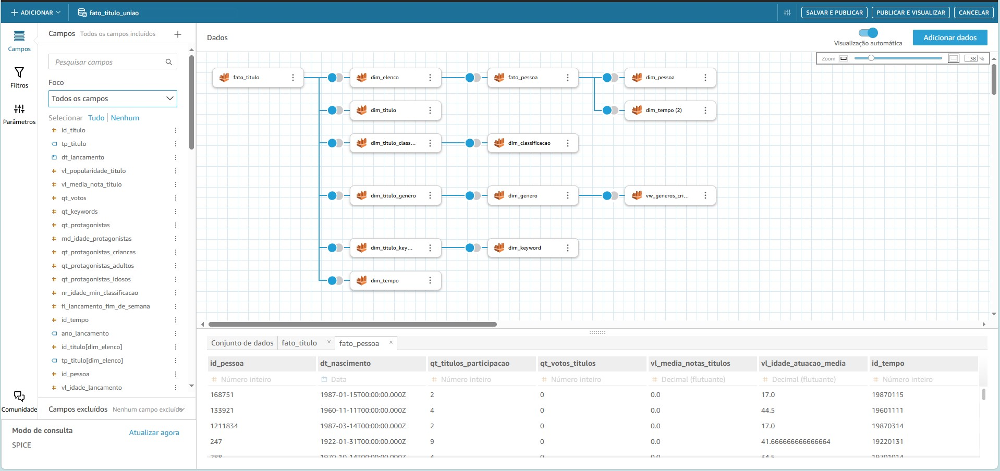                                                   

_*Evidência 16 - *_

 

## :thinking: Ah, Rochelly, mas e agora? O que você quer ser?

Depois de muito trabalho árduo e noites sem dormir, percebo que evoluí bastante e o que mais me deixou animada na produção foi a àrea de engenharia de dados. É muito satisfatório descobrir um dado e com a dedicação e tratamentos necessários, transformar em informação, algo como um paleontólogo que descobre um osso fossilizado que com dedicação e tratamento, transforma em informações de uma nova espécie de "dinossauro híbrido" (tudo bem, parei com as analogias).

 

Me despeço agradecendo imensamente a oportunidade. Ser funcionária pública me manteve num estado de estagnação que me incomodava, mas que não me permitia mover. A maternidade contribuiu para essa urgência de mudança, pela esperança de ter uma qualidade de vida melhor e mais valorizada.

Agradeço muito pela paciência e empatia que tiveram comigo o tempo todo.
Não sei se tive sorte de cair em uma turma tão prestativa ou se era pra ser assim mesmo, mas com certeza, os maiores motivos que não me fizeram desistir, foi o apoio do time e principalmente pelo apoio da nossa Scrum Master, o verdadeiro Dream Team.
Não tenho palavras para descrever o quanto a Marli foi (e é) necessária e indispensável para me manter, nem tão firme, nem tão forte rs, mas seguindo até este final.

Foram 05 meses de muita intensidade, evolução e que deixarão muitas saudades.

  

:white_check_mark:
:sun_with_face:
