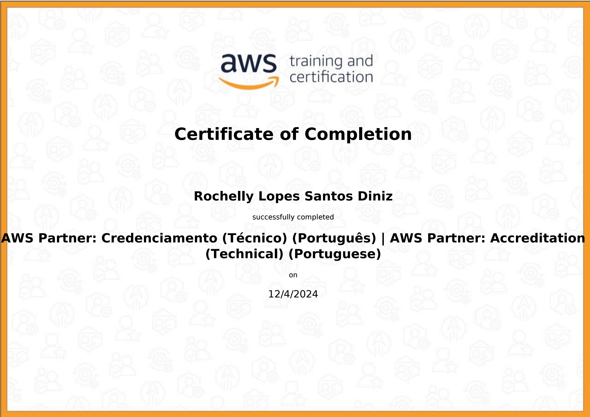

# :hourglass_flowing_sand: Sprint 4 - Python 3, Docker e AWS Partner: Accreditation (Technical)
:calendar: 25/11 à 09/12/2024

 

### :writing_hand: Resumo

<!-- Nesta sprint trabalhamos com Pyhton em seus comandos básicos e intermediários, realizando desafio utilizando as bibliotecas Pandas e Matplotlib, com intuito de nivelar o conhecimento de todos os bolsitas.                  
Pela AWS, aprendemos sobre os aspectos econômicos da nuvem. -->
Ao final do curso foram emitidos dois certificados, presentes no diretório [certificados](./certificados/).

 

### :trophy: Certificados

- AWS Partner: Accreditation (Technical)

  

- AWS Technical Essentials

 

### :jigsaw: Desafio

 <!-- O desafio dessa sprint é praticar em Python, combinando conhecimentos adquiridos no Programa de Bolsas. -->                      
 O relatório do desafio e os arquivos gerados estão no diretório [desafio](./desafio/README.md).

 

### :brain: Exercícios

 

Todos os scripts gerados estão disponíveis no diretório [exercicios](./exercicios/) e os seus arquivos de resultados se encontram em [evidencias](./evidencias/evid_exercicios/).

Abaixo relaciono alguns que gostaria de compartilhar.

  

#### :recycle: 
