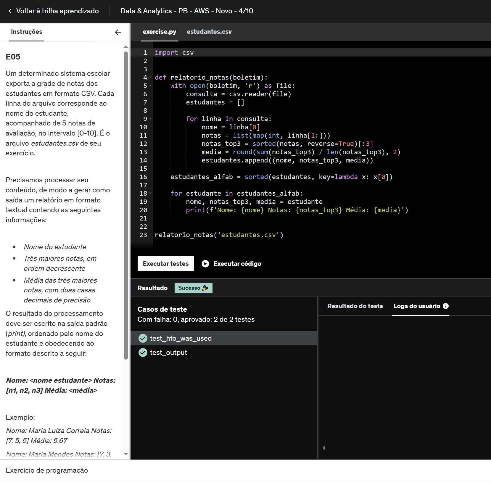

# :hourglass_flowing_sand: Sprint 4 - Python 3, Docker e AWS Partner: Accreditation (Technical)
:calendar: 25/11 à 09/12/2024

 

### :writing_hand: Resumo

- Nesta sprint trabalhamos programação funcional. Primeiramente foi disponibilizado uma matéria da Alura que define e explica o que é a programação funcional e seu surgimento.
- Num segundo momento, foi feito o curso "Python 3 - Curso Completo do Básico ao Avançado", realizando desafio utilizando a programação funcional.
- Para finalizar esta etapa, conhecemos o Docker através do curso "Docker para Desenvolvedores (com Docker Swarm e Kubernetes).
- Pela AWS, obtivemos conhecimento técnico fundamental no console sobre computação em nuvem da AWS, infraestrutura global, serviços soluções e segurança. Ao final do curso foram emitidos dois certificados, presentes abaixo e no diretório [certificados](./certificados/).

 

### :trophy: Certificados

- AWS Partner: Accreditation (Technical)

  

- AWS Technical Essentials

 

### :jigsaw: Desafio

 O desafio dessa sprint é praticar Python com Containers Docker combinando conhecimentos adquiridos no Programa de Bolsas.          
 O relatório do desafio e os arquivos gerados estão no diretório [desafio](./desafio/README.md).

 

### :brain: Exercícios

 

Todos os scripts gerados estão disponíveis no diretório [exercicios](./exercicios/) e os seus arquivos de resultados se encontram em [evidencias](./evidencias/evid_exercicios/).

Abaixo relaciono alguns que gostaria de compartilhar.

 

* Exercício 04: Criada a função ``calcular_valor_maximo``, onde era preciso utilizar muitas comparações e combinações entre operações aritméticas e listas. Foi um exercício complexo de ser realizado.

                          
_*Evidência EX04: Exercício complexo.*_

 

* Exercício 05: Criada a função ``relatório_notas``, cujo objetivo era mostras as meiores notas e a média de cada aluno. Não chegou a ser um exercício muito complexo, porém, foi muito difícil seguir para o próximo exercício até entender o erro da linha 11, onde era necessário qeu as notas fossem tipificadas como ``int``.

                          
_*Evidência EX05-1: Exercício concluído depois de muito quebrar a cabeça.*_

 

                          
_*Evidência EX05-2: Mostrando o código executado para verificar o resultado do script.*_
