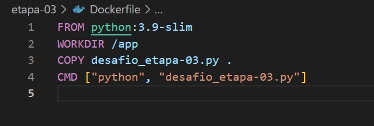

# :jigsaw: Desafio - Sprint 4

:calendar: 25/11/2024 à 09/12/2024

 

## :dart: Objetivo

Praticar Python com Containers Docker combinando conhecimentos adquiridos no Programa de Bolsas.

 

<!-- ## :thinking: Descrição 

Através de um dataset da loja de aplicativos da Google em .csv, criar um arquivo no formato .ipynb contendo código no modelo Notebook, com execução realizada. Incluir células em Markdown com documentação de cada célula de código criado

  -->

## :heavy_check_mark: Etapas

Obs.: Todas as evidências deste desafio encontram-se no diretório [evidências](../evidencias/evid_desafio/).

 

* [:scroll: 3. Preparação](#-3-preparação)
* [:package: 4.1 Etapa 1: Carguru](#-41-etapa-1-carguru)
* [:recycle:  4.2 Etapa 2: Reutilização de Containers](#️-42-etapa-2-reutilização-de-containers)
* [:performing_arts: 4.3 Etapa 3: Mascarar Dados](#-43-etapa-3-mascarar-dados)

 

### :scroll: 3. Preparação

* Fazer o download do arquivo `carguru.py`, como entrada no processo.

  

### :package: 4.1 Etapa 1: Carguru

Nesta etapa foi solicitada a construção de uma imagem a partir de um arquivo de instruções `Dockerfile` que execute o código ``carguru.py``, e depois, executar o container com a imagem criada.

 

                       
_*Evidência et01-01 - O primeiro passo para criar uma imagem é elaborar o arquivo de instruções Dockerfile onde são informadas a linguagem do arquivo, para qual diretório deve ir, copiar os arquivos necessários para o diretório criado e enviar o comando de execução.*_

 

                       
_*Evidência et01-02 - O comando `docker build -t app .` constrói a imagem (docker build), dá um nome para ela (-t xxx).*_

 

                        
_*Evidência et01-03 - O comando `docker image ls` lista as imagens criadas. Destacado na imagem, no repositório, encontramos a imagem app que foi criada.*_

 

                 
_*Evidência et01-04 - O comando `docker run -it app` executa o container com a imagem criada.*_

 

                
_*Evidência et01-05 - O comado `docker ps -a` mostra os container's executados.*_

 

                    
_*Evidência et01-06 - No momento que o dá tudo certo e o comando funciona, logo foi printado a resposta do arquivo, mostrando randomicamente o carro da lista ``carros []``.*_

  

### :recycle: 4.2 Etapa 2: Reutilização de Containers

 

Nesta etapa foi realizada a seguinte pergunta a ser respondida num arquivo Markdown:

 

> ***É possível reutilizar containers? Em caso positivo, apresente o comando necessário para reiniciar um dos containers parados em seu ambiente Docker. Não sendo possível reutilizar, justifique sua resposta.***

 

_*Sim, é possível reutilizar containers com o comando ``restart``.             
Usando o caso da etapa 1, ficaria da seguinte forma:
``docker restart 6ffbfaea0b18`` ou ``docker restart adoring_lehmann``.*_

 

               
_*Evidência et02-01 - Executei o comando `restart` utilizando a etapa-01 como exemplo. No primeiro momento na listagem dos containers, é possível verificar que o container havia passado pelo restart há 4 horas, no meu primeiro teste. Logo após, "restartei" novamente, trazendo numa posterior consulta, a informação que o mesmo container foi reinicializado há 07 segundos.*_

  

### :performing_arts: 4.3 Etapa 3: Mascarar Dados

Na última etapa, foi solicitada a criação de um container que pudesse receber inputs durante a execução. Para isso, precisávamos criar um script Python que implementasse o mascaramento das palavras recebidas através do hash SHA-1.

                          
_*Evidência et03-01 - Script Pyhton criado com as instruções solicitadas.*_

 

                                      
_*Evidência et03-02 - Arquivo Dockerfile para criação da imagem.*_

 

                                      
_*Evidência et03-03 - Dentre as instruções, foi solicitado que a tag dessa imagem fosse ``mascarar-dados``.*_

 

                                      
_*Evidência et03-04 - Imagem criada conforme solicitado.*_

 

                                      
_*Evidência et03-05 - Container rodando e os resultados da execução do script.*_

  

:white_check_mark:
:sun_with_face:
