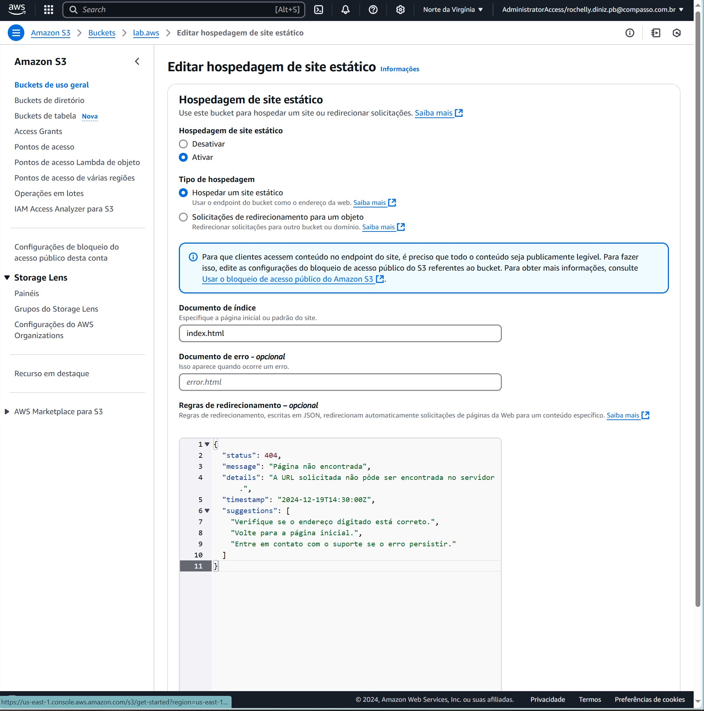

# :hourglass_flowing_sand: Sprint 5 - AWS: Cloud Quest e Certified Cloud Practitioner
:calendar: 09/12 à 23/12/2024

### :writing_hand: Resumo

- Nesta sprint "colocamos a mão na massa" quanto a plataforma AWS.
- Em primeiro momento, tivemos uma experiência de aprendizado baseada em funções projetada para treinar habilidades práticas na Nuvem AWS, através do jogo Cloud Quest.
- Após, realizamos o Curso-padrão de preparação para o exame: AWS Certified Cloud Practitioner curso de nível básico da AWS, para aprender e avaliar nosso nível de preparação para o exame CLF-C02.

Ao final do curso foram emitidos dois certificados, presentes abaixo e no diretório [certificados](./certificados/).

 

### :trophy: Certificados

- AWS Cloud Quest: Cloud Practitioner

  
- AWS Certified Cloud Practitioner (CLF-C02)

 

### :jigsaw: Desafio

 O desafio dessa sprint é praticar os conhecimentos de AWS.          
 O relatório do desafio e os arquivos gerados estão no diretório [desafio](./desafio/README.md).

 

### :brain: Exercícios

 

Todos os prints gerados estão disponíveis no diretório [exercicios](./exercicios/) e os seus arquivos de resultados se encontram em [evidencias](./evidencias/evid_exercicios/).

Abaixo relaciono alguns que gostaria de compartilhar.

 

#### AWS Cloud Quest: Cloud Practitioner

* Com a possibilidade de criar e personalizar avatar, fazer amizades com pets (sem limitar espécies), caçar drones e ajudar a comunidade, o jogo Cloud Quest me permitiu aprender sobre os serviços da AWS de forma lúdica e prática. Mesmo sendo bastante conteúdo, foi possível absorver bem as informações.

                          
_*Cloud Quest: Selfie do meu avatar com minha gata. Ao fundo, é possível ver uma girafa, que também é um pet.*_

 

* Foram resolvidas diversas situações no decorrer do jogo e, com isso, conseguimos trabalhar com diversos serviços oferecidos pelas AWS como EC2, S3, DynamoDB, RDS, entre outros.

_*Cloud Quest: Configurações de instâncias para Zonas de Disponibilidade.*_

 

_*Cloud Quest: Alterar confirgurações de segurança.*_

 

_*Cloud Quest: Executar réplica de leitura.*_

 

 

#### AWS Certified Cloud Practitioner

 

                          
_*Evidência 01: Mostrando que dentro de Amazon S3, o bucket lab.aws foi criado._

 

                          
_*Evidência 02: Seguindo até o campo Hospedagem de site estatistico.*_

 

                          
_*Evidência 03: Editar em Hospedagem do site estatistico.*_

 

                          
_*Evidência 04: Subir arquivos.*_

 

                          
_*Evidência 05: Incluir os arquivos ``.html`` como documentos de índice e erro.*_

 

                          
_*Evidência 06: Editar permissões de acesso.*_

 

                          
_*Evidência 07: Site estático hospedado com sucesso.*_
