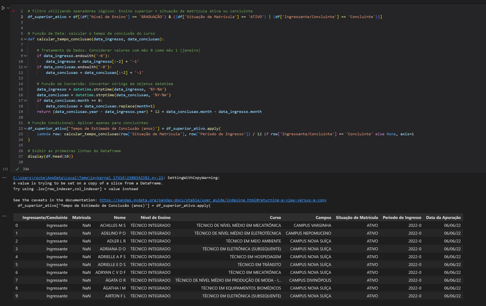
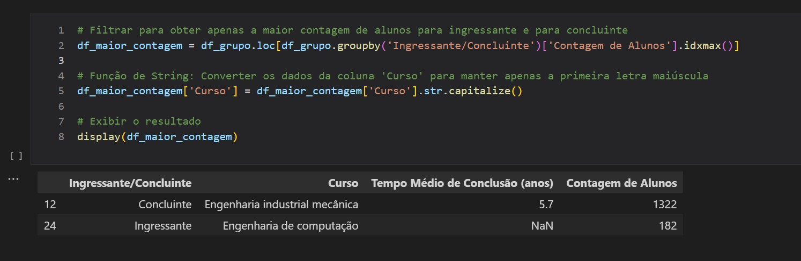

# :jigsaw: Desafio - Sprint 5

:calendar: 09/12/2024 à 23/12/2024

 

## :dart: Objetivo

Praticar os conhecimentos de AWS.

 

## :heavy_check_mark: Etapas

Obs.: Todas as evidências deste desafio encontram-se no diretório [evidências](../evidencias/evid_desafio/).

 

* [:scroll: 3. Preparação](#-3-preparação)
* [:package: 4. AWS S3 - Carregar arquivo para um bucket](#-4-aws-s3---carregar-arquivo-para-um-bucket)
* [:snake: 4. Python - Manipulação de Dados](#-4-python---manipulação-de-dados)
* [:dolphin: 5. Boto3 - Salvar resultado em .csv e enviar para o bucket](#-5-boto3---salvar-resultado-em-csv-e-enviar-para-o-bucket)

 

### :scroll: 3. Preparação

 Procurar um arquivo .csv ou .json no [Portal de Dados Abertos](https://dados.gov.br/home) do Governo Federal. A princípio havia escolhido um dataframe que levantava os animais ameaçados de extinção no Brasil, porém, ao analisar friamente, percebi que não havia tipos de dados importantes para o que eu gostaria de apresentar. Então fiz outra busca e encontrei o atual:

 

> #### Dataset: Centro Federal de Educação Tecnológica de Minas Gerais - CEFET-MG
> Fonte: Dados Abertos - Governo Federal            
> Plano de Dados Abertos 2022-2024 / Última atualização: 14/02/2023         
> Relação de todos os alunos ingressantes e formandos, por ciclo acadêmico.        
> Disponível em ``https://dados.gov.br/dados/conjuntos-dados/12-alunos``

  

### :basket: 4. AWS S3 - Carregar arquivo para um bucket

* Criação de um bucket novo para execução do desafio.
                       
_*Evidência 01 - Página inicial dos buckets no serviço AWS S3. O bucket deste desafio é o ``desafio-dados.abertos``.*_

 

* A partir de um script Python, carregue o dataset para o bucket criado.

    
                    
_*Evidência 02 - Código em Python para baixar o dataset diretamente da fonte e subir para o bucket. Importante falar aqui sobre a função ``load_dotenv``. Esta função é utilizada para carregar variáveis de ambiente de um arquivo ``.env`` para o ambiente do sistema. Sendo útil para manter informações sensíveis, como chaves de API e senhas, fora do código-fonte, ao utilisar ``load_dotenv``, essas variáveis podem ser acessadas no código como se fossem definidas diretamente no ambiente do sistema. Neste caso, para manter os dados em sigilo, ao subir no Git, fiz um ``gitignore`` para o arquivo ``.env``.*_

 

* O script Pyhton enviou o arquivo .csv para o bucket com sucesso.

                       
_*Evidência 03 - Arquivo ``PDA_2022-2024_1.2_Alunos_Anonimo.csv`` no bucket.*_

  

### :snake: 4. Python - Manipulação de dados

 

* Criar outro script Python para criação de DataFrame com ``pandas`` ou ``polars`` para executar diversas manipulações.

                       
_*Evidência 04-0 - Para melhor visualização e para escrever este relatório, fiz o script em ``.ipynb``, como exemplo. No arquivo entregue ``df_dados-abertos.py``, toda a importação dos dados segue, conforme solicitado, através do bucket.*_

 

                       
_*Evidência 04-1 - Filtro utilizando dois operadores lógicos; Função de Data; Função de Conversão; .*_

 

                       
_*Evidência 04-2 - Função de Agregação.*_

 

                       
_*Evidência 04-3 - Filtro para obter o maior número de alunos por ingressante e para concluinte; Função de String;.*_

 

                       
_*Evidência 05 - Resultado Final.*_

  

### :dolphin: 5. Boto3 - Salvar resultado em .csv e enviar para o bucket

* Após concluir as etapas anteriores, salvar o arquivo no formato ``.csv`` e enviar para o bucket, utilizando boto3.

                       
_*Evidência 06 - Código realizado para subir arquivo ao bucket.*_

 

                       
_*Evidência 07 - Resultado Final - Os dois arquivos solicitados já no bucket.*_

 

## :tada: Desafio concluído com sucesso! :champagne:
#### .... Feliz Natal e um 2025 cheio de luz e saúde ....                  
:santa: :christmas_tree: :mrs_claus: :ribbon: :snowman: :gift: :dove: :star2: :latin_cross: :pray: :candle: :bell: :love_letter: :fireworks:
  

  

:white_check_mark:
:sun_with_face:
