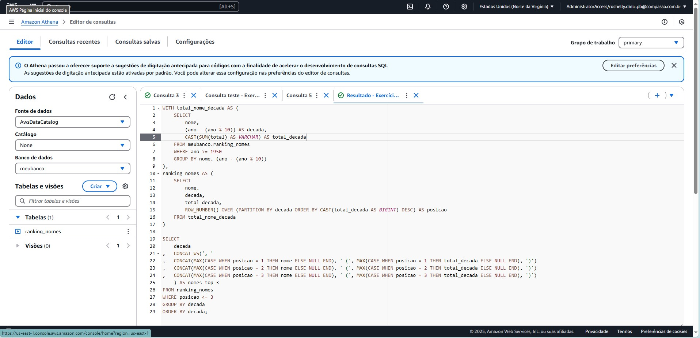
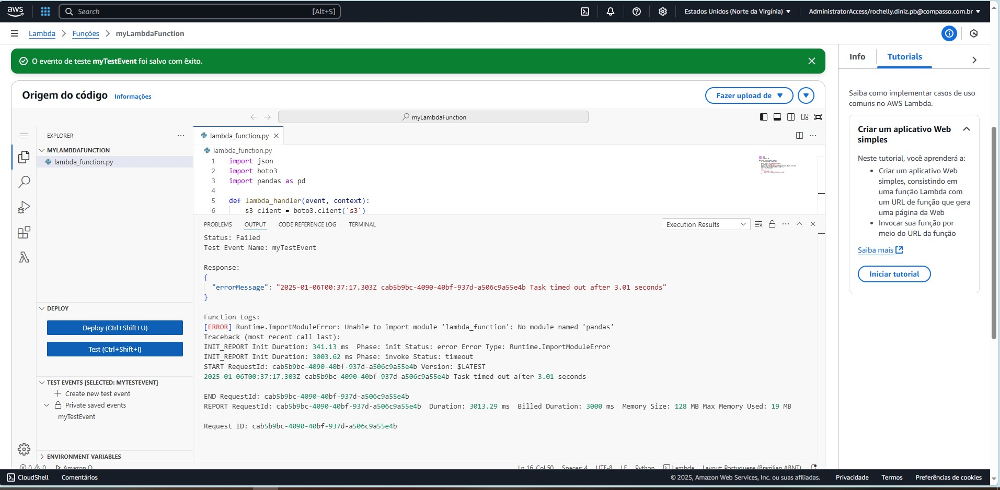

# :hourglass_flowing_sand: Sprint 6 - AWS: Skill Builder
:calendar: 23/12 à 06/01/2025

### :writing_hand: Resumo

- 

Ao final da sprint foram emitidos nove certificados, presentes abaixo e no diretório [certificados](./certificados/).

 

### :trophy: Certificados

- Fundamentals of Analytics on AWS - Part 1

  

- Fundamentals of Analytics on AWS - Part 2

  

- Getting Started with Amazon Redshift

  

- Best Practices for Data Warehousing with Amazon Redshift

  

- Introduction to Amazon Athena

  

- Serverless Analytics

  

- Amazon EMR Getting Started

  

- Amazon Glue Getting Started

  

- Amazon QuickSight Getting Started

  

 

### :jigsaw: Desafio

 O desafio dessa sprint é praticar a combinação de conhecimentos vistos no Programa de Bolsas, fazendo um mix de tudo que já foi dito.          
 O relatório do desafio e os arquivos gerados estão no diretório [desafio](./desafio/README.md).

 

### :brain: Exercícios

 

Todos os prints gerados estão disponíveis no diretório [exercicios](./exercicios/) e os seus arquivos de resultados se encontram em [evidencias](./evidencias/evid_exercicios/).

Abaixo relaciono alguns que gostaria de compartilhar.

 

#### Lab 2 - S3

Criação de bucket para hospedagem de site estático!

              
_*Evidência Lab2-1 - Criado bucket.*_

 

_*Evidência Lab2-2 - Edição da política de bucket.*_

 

_*Evidência Lab2-3 - Carregando o arquivo ``.csv`` e as páginas de ``index.html`` e ``erro.html``.*_

 

_*Evidência Lab2-4 - Edição da hospedagem de site estático.*_

 

_*Evidência Lab2-5 - Resultado da hospedagem.*_

  

#### Lab 3 - Athena

Criação de banco de dados e tabela, utilizando o mesmo arquivo do exercício anterior. O resultado do lab está na pasta de [exercícios](./exercicios/)

              
_*Evidência Lab3-1 - Criado bucket com diretório ``queries/`` e arquivo ``nomes.csv``.*_

 

_*Evidência Lab3-2 - Criado banco de dados ``meubanco``.*_

 

_*Evidência Lab3-3 - Criada a tabela ``ranking_nomes``.*_

 

_*Evidência Lab3-4 - Realizada querie teste.*_

 

_*Evidência Lab3-5 - Código feito para levantar os 3 nomes mais registrados desde a década de 50, que é a proposta do laboratório.*_

 

_*Evidência Lab3-6 - Resultado da querie.*_

  

#### Lab 4 - Lambda

Criação de função Lambda.

              
_*Evidência Lab4-1 - Criada a função Lambda utilizando Python.*_

 

_*Evidência Lab4-2 - Criado teste de evento.*_

 

_*Evidência Lab4-3 - Execução falha  do teste de evento.*_

 

_*Evidência Lab4-4 - Criado Dockerfile e construída sua imagem.*_

 

_*Evidência Lab4-5 - Criação da camada com a biblioteca pandas recebida por container no passo anterior.*_

 

_*Evidência Lab4-6 - Adicionando camada criada à função.*_

 

_*Evidência Lab4-7 - Propriedades da função, informando a exixtência da camada criada.*_

 

_*Evidência Lab4-8 - Função testada com sucesso.*_

Apesar de não ter registrado as evidências, foi necessário ajustes na permissão do bucket no S3 e aumento de tempo limite e memória na função do Lmabda.

  

#### Lab 5 - Excluir todos os materiais realizados na AWS para os laboratórios

Para não correr o risco de gastos desnecessários, foi solicitado para que fosse excluído tudo o que foi gerado para os laboratórios, presentes nos serviços AWS.

              
_*Evidência Lab5-1 - Exclusão da função ``myLambdaFunction``.*_

 

_*Evidência Lab5-2 - Exclusão do bucket ``lab.aws`` utilizado na sprint anterior.*_

 

_*Evidência Lab5-3 - Exclusão do bucket ``sprint6-lab-aws-s3`` utilizado nesta sprint.*_

 

_*Evidência Lab5-4 - Exclusão do bucket ``sprint6-lab-aws-athena`` utilizado nesta sprint.*_

 

_*Evidência Lab5-5 - Exclusão do bucket ``sprint6-lab-aws-lambda`` utilizado nesta sprint.*_

 

_*Evidência Lab5-6 - Tela do Amazon S3 após exclusão dos buckets criados em laboratório.*_
