# :hourglass_flowing_sand: Sprint 7 - AWS e Spark
:calendar: 06/01 à 20/01/2025

### :writing_hand: Resumo

- 

 

### :trophy: Certificados

Nessa Sprint não houve curso externo, portanto, não há certificado a ser apresentado.

 

### :jigsaw: Desafio

 O objetivo dessa sprint é complementa os dados dos Filmes e Séries com dados oriundos da API do TMDB.
 O relatório do desafio e os arquivos gerados estão no diretório [desafio](./desafio/README.md).

 

### :brain: Exercícios

 

Todos os prints gerados estão disponíveis no diretório [exercicios](./exercicios/) e os seus arquivos de resultados se encontram em [evidencias](./evidencias/evid_exercicios/).

Abaixo relaciono alguns que gostaria de compartilhar.

 

#### 5 - Exercício Apache Spark - Contador de Palavras

Desenvolvimento de job de processamento com o framework Spark por meio de container Docker.

* Para começar, foi necessário o ``pull`` de uma imagem para utilizar o Jupyter pelo Shell do Spark.                          

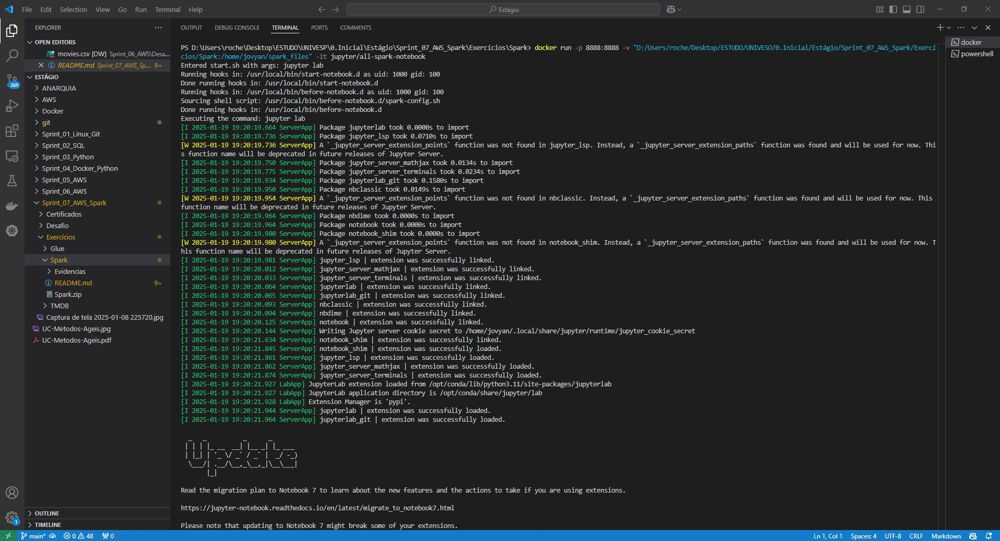              
_*Evidência Ex5-1 - Container rodando, utilizando comando complementado de ``-it`` para execução de forma interativa.*_

 

* O container fornece um link para acessar o Jupyter Lab no navegador.              

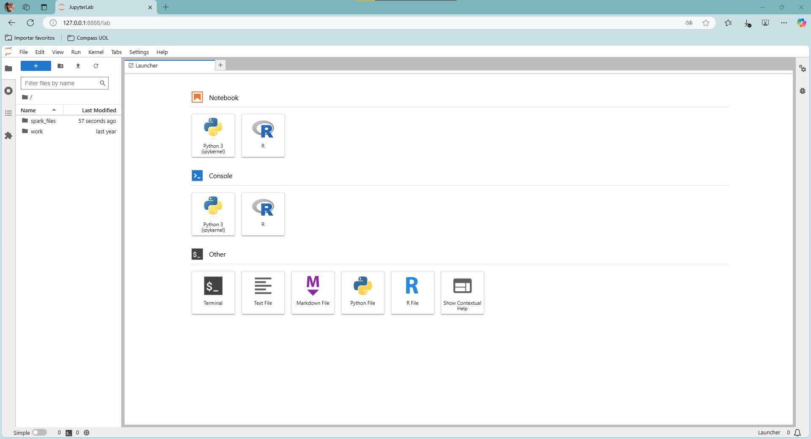              
_*Evidência EX5-2 - Interface do Jupyter Lab.*_

 

* Criado código para um contador de palavras de um arquivo Markdown. Depois de alguns testes, cheguei ao código final.          

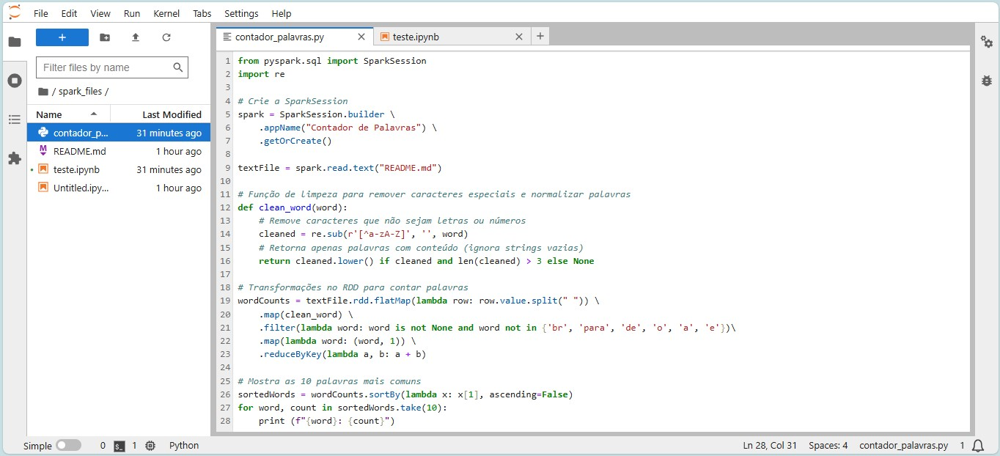              
_*Evidência Ex5-3 - Não consegui baixar o arquivo ``.py`` que foi gerado no shell, então a evidência que tenho é esse print.*_

 

* Utilizei um README de sprints anteriores para usar no exercício. Refinei da forma que achei mais prudente, desconsiderando "palavras" com menos de 4 letras, algumas preposições, artigos, caracteres especiais etc.                         

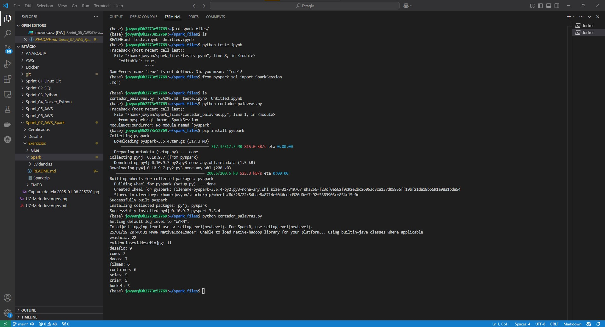              
_*Evidência Ex5-4 - Ao final, o resultado foi impresso no terminal.*_

 

* Este foi o resultado do script, após refinamento.                             

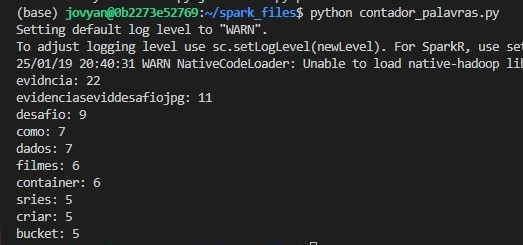              
_*Evidência Ex5-5 - Sendo ``evidência`` palavra mais utilizada.*_

  

#### 6 - Exercício TMDB

Criação de processo de extração de dados da API do TMDB utilizando serviços AWS. O resultado do exercício está na pasta de [exercícios](./exercicios/)

 

* O primeiro passo deste exercício é a criação de conta no TMDB.                         

              
_*Evidência Ex6-1 - Após algumas instruções de configuração o TMDB fornece a chave token que permite as buscas da API.*_

 

* No conteúdo presente na Udemy, nos é apresentado um passo-a-passo para criar um teste utilizando endpoint de filme e, após isso, executarmos o exercício.                         

* Para o meu código, utilizei o endpoint de séries para mostrar os títulos melhores avaliados. Apesar de parecer ser igual ao de séries, é possível analisar no código que algumas colunas não são iguais nos dois tipos.

              
_*Evidência Ex6-2 - Resultado do script que ao final é salvo também em arquivo ``.csv``.*_

  

#### 7 - Lab Glue

Construção de um processo de ETL simplificado utilizando AWS Glue.

 

* Foi fornecido um arquivo ``.csv`` para ser salvo em um bucket no S3 com path determinado.                         

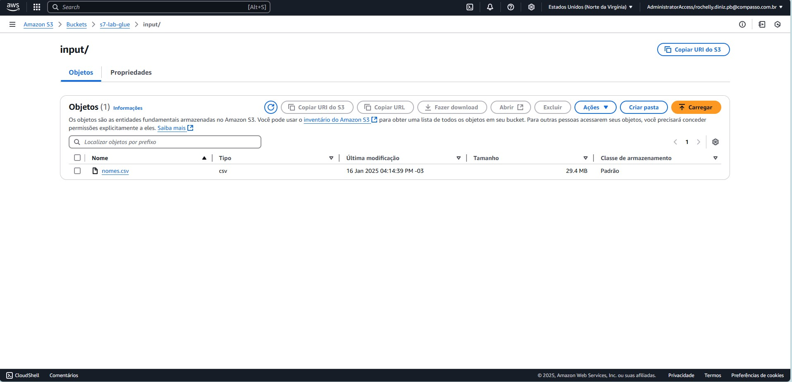              
_*Evidência Lab7-1 - Arquivo salvo conforme determinado.*_

 

* Também foi ensinada a criação de Role (através do IAM) para os Jobs do Glue.                         

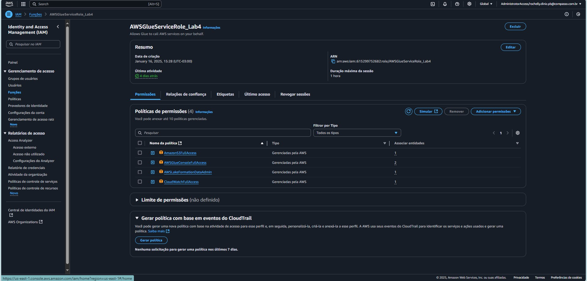              
_*Evidência Lab7-2 - Criado Role ``AWSGlueServiceRole-Lab4`` associada às políticas geridas pela AWS.*_

 

* Após muito outros passos de configuração, criamos o Job.                         

              
_*Evidência Lab7-3 - Assim como nos exercícios anteriores, primeiro criamos um teste do conteúdo da Udemy e depois fazemos nosso próprio exercício.*_

 

* Código feito, após alguns erros no caminho, o job é executado com sucesso.                         

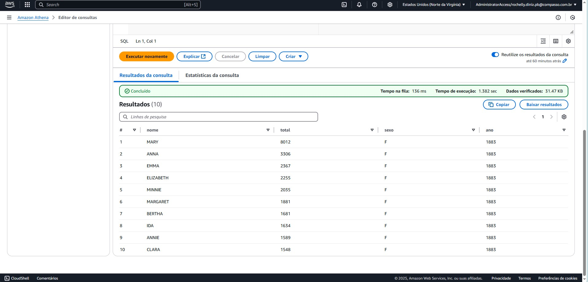              
_*Evidência Lab7-4 - Resultado do script codado no Athena. O código deve ler o arquivo do bucket, imprimir o schema, deixar os nomes em ``CAIXA ALTA``, imprimir a contagem de linhas, de nomes, dentre outras especificações.*_

 

* Alguns requisitos foram dados para o arquivos de saída.                         

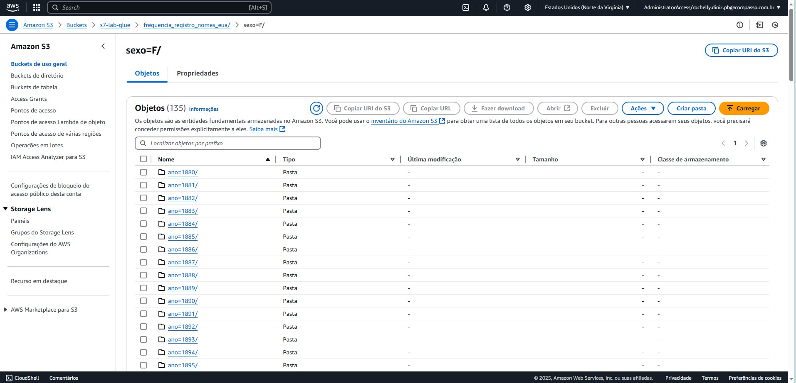              
_*Evidência Lab7-5 - A gravação deve ser em path específico, em formato JSON e particionados por ``Sexo`` e ``Ano``.*_

 

* Resultando nos diretórios apresentados.                         

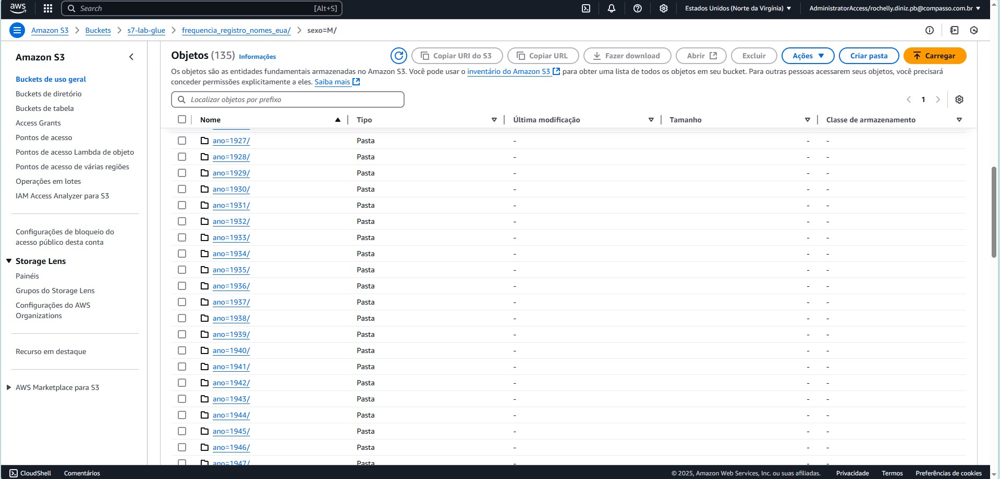              
_*Evidência Lab7-6 - Foram divididos primeiramente em sexo e depois em anos.*_

 

* Foi dada a dica de verificar os Logs de execução.                         

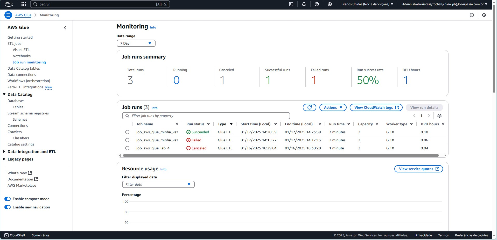              
_*Evidência Lab7-7 - Logs de Execução.*_

 

* E mais detalhadamente no ``CloudWatch continuous logs``.                         

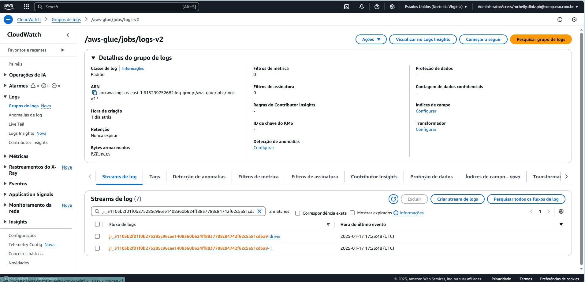              
_*Evidência Lab7-8 - Detalhes do grupo de logs.*_

 

* Por fim, foi criado um ``Crawler``, que cria uma tabela a partir do s dados escritos no S3 de forma automática.                         

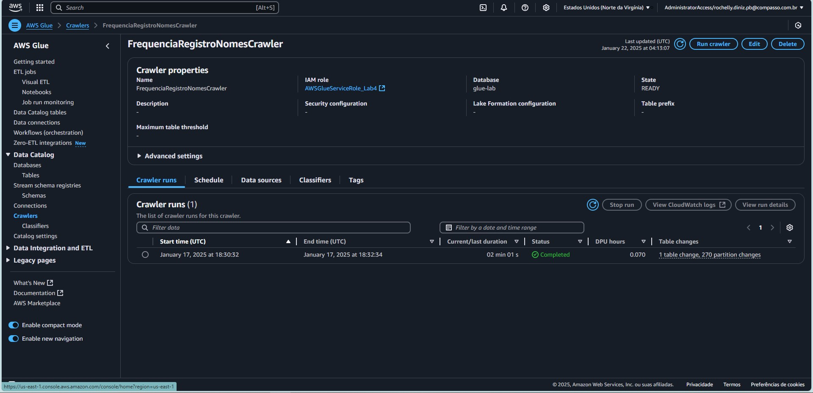              
_*Evidência Lab7-9 - Neste exercício foi determinado que a frequência de execução fosse realizada apenas ``on demand``.*_