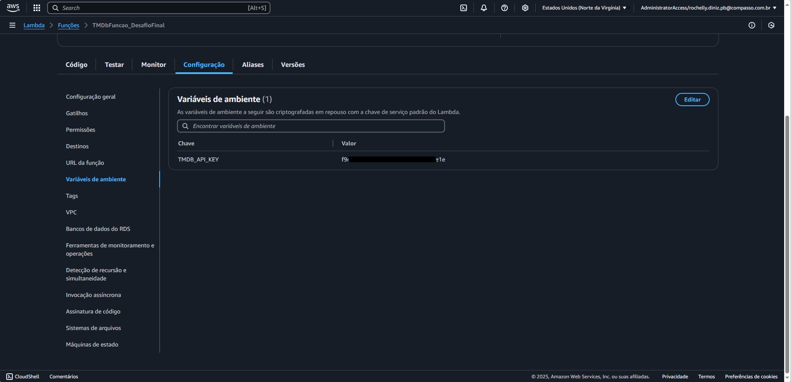

# :jigsaw: Desafio - Sprint 7

:calendar: 06/01 à 20/01/2025

 

## :dart: Objetivo

 O desafio dessa sprint é praticar a combinação de conhecimentos vistos no Programa de Bolsas, fazendo um mix de tudo que já foi dito.

 

## :rocket: Desafio Final - Filmes e Séries

O Desafio de Filmes e Séries está dividido em 5 entregas.                           
Trata-se de um desafio para construção de um Data Lake, com as estapas de Ingestão, Armazenamento, Processamento e Consumo.

Nesta Sprint, é preciso explicar os motivadores de utilização de cada API e explicitar as questões que serão respondidas na última etapa do desafio.

_Sigo mantendo minha análise sobre a utilização de crianças em elencos principais em títulos do gênero de terror e mistério_

_Algumas questões que deverão ser respondidas na útima etapa do desafio: Qual a média de idade das crianças? Quais são as que mais participaram de produções do gênero? Qual a classificação indicativa médias para essas produções? Quantas dessas crianças vieram a óbito ainda na infância?_

_Popularmente, o gênero de terror traz algumas crenças, dentre elas a Maldição do Gênero, onde eventos acontecem durante sua produção ou após lançamento, trago o exemplo da atriz Heather O'Rourke de Poltergeist - O Fenômeno. No lançamento do filme, a atriz tinha 07 anos e faleceu aos 12 anos, por um erro médico._

 

## :heavy_check_mark: Etapas - Entrega 2

Obs.: Todas as evidências deste desafio encontram-se no diretório [evidências](../evidencias/evid_desafio/).

 

* [:clapper:  The Movie Database](#---the-movie-database)
* [:closed_lock_with_key: Ingestão de API](#-ingestão-de-api)
* [:file_folder: Criação da Layer](#-criação-da-layer)

 

### :clapper:   The Movie Database

Para a entrega desta etapa, foi solicitada a captura de dados da base The Movie Database, através de sua API. O TMDb é gratuito e de código aberto e possui um acervo gigantesco de informações sobre filmes e séries. Com a finalidade de estudo (não comercial), é possível ter acesso à API, livremente.

### 

         
_*Evidência 0 - Página inicial do TMDb.*_

  

### :closed_lock_with_key: Ingestão de API

A ingestão dos dados deve ser realizada capturando as informações do TMDB via AWS Lambda realizando chamadas de API e salvando os resultados coletados em arquivos JSON com o máximo de 100 registros por arquivo.

 

Para começar o script, foi necessário a importação das seguintes bibliotecas:             

           

_*Evidência 1 - Bibliotecas importadas*_

 

É necessário informar minha credencial para acesso à plataforma. Diferente de um script em máquina, no Lambda não é possível utilizar o ``.env``, porém, o Lambda fornece uma opção para registrar as variáveis de ambiente.               

                       
_*Evidência 2 - Gravação da Variável de Ambiente.*_

 

Esse bloco traz as linhas necessárias para configurar o ambiente.

                       
_*Evidência 3 - Variáveis para acesso à API, configuraçõ de fuso horário, bucket onde serão salvos os resultados e endpoints das buscas.*_

 

Função para buscar os dados através dos parâmetros elencados.

                       
_*Evidência 4 - Esta função resultará em todos os títulos de terror e mistério.*_

 

Enviar os arquivos para o Amazon S3. Inclui o código que faz a criação dos diretórios conforme solicitado.

                       
_*Evidência 5 - Blocos de código para envio dos dados ao bucket no S3.*_

 

                  

Determinados os parâmetros, a busca é realizada e os resultados salvos.

                       
_*Evidência 6 - Linhas do bloco ``lambda_handler``.*_

 

Finalizadas as etapas, o script mostra as informações das quantidade de registros salvos e em quantos arquivos.              

                       
_*Evidência 7 - No vídeo do desafio, acabo falando a quantidade de arquivos erradas ao mostrar já no bucket. Mas os dados informados no comando ``body`` estão corretos.*_

  

### :file_folder: Criação da Layer

Foi necessária a criação de uma layer para instalação das bibliotecas necessárias para execução do script.

                       
_*Evidência 8 - Como o arquivo ``.zip`` ultrapassou o limite de 10mb para carregar diretamente na camada, salvei o mesmo no bucket do desafio.*_               

 

Também foi preciso a criação de uma Role no IAM.

                       
_*Evidência 9 - Role ``TMDbFuncao_DesafioFinal``*_

 

E após muita tentativa e erro...
                       
_*Evidência 10 - ... finalmente chega a mensagem de sucesso.*_

 

                       
_*Evidência 11 - Os arquivos foram salvos de acordo com o solicitado tanto para filmes..*_

 

                       
_*Evidência 12 - ... quanto para as séries.*_

  

:white_check_mark:
:sun_with_face:

