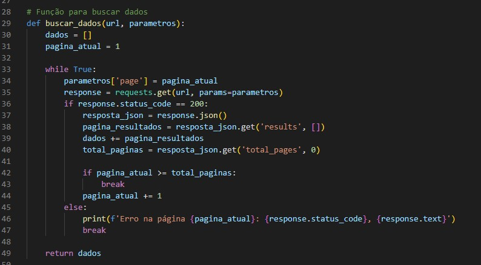
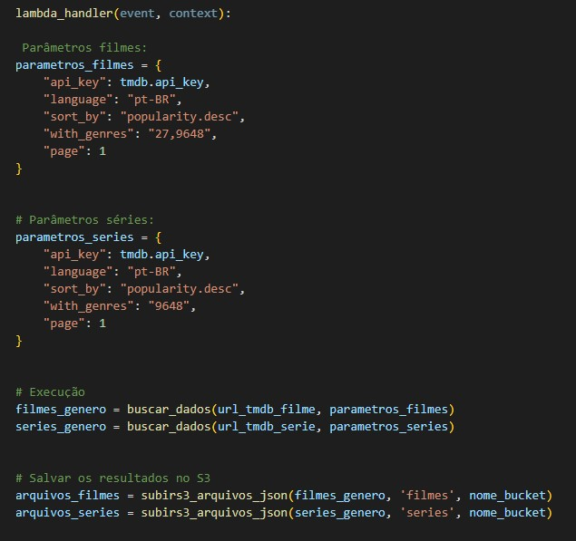
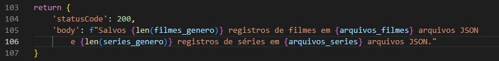
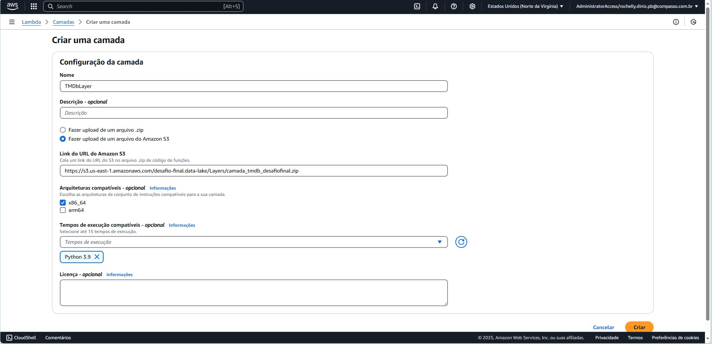

# :jigsaw: Desafio - Sprint 6

:calendar: 06/01 à 20/01/2025

 

## :dart: Objetivo

 O desafio dessa sprint é praticar a combinação de conhecimentos vistos no Programa de Bolsas, fazendo um mix de tudo que já foi dito.

 

## :rocket: Desafio Final - Filmes e Séries

O Desafio de Filmes e Séries está dividido em 5 entregas.                           
Trata-se de um desafio para construção de um Data Lake, com as estapas de Ingestão, Armazenamento, Processamento e Consumo.

Para começar, é preciso explicar sobre o que se trata o desafio e qual será o motivo da minha análise.

_Minha análise busca identificar crianças que atuaram em filmes e séries de terror e mistério. A faixa etárea a ser considerada será a de 0 a 12 anos._

_Vou cruzar o ano de nascimento dos atores com a data de lançamento das produções para responder perguntas como: "Quantas crianças atuaram em produções desses gêneros ao longo do tempo?", "Essas crianças se mantiveram atuando posteriormente?", "Como são as avaliações dessas produções?" e assim por diante._

_Como exemplo, na série Stranger Things, a atriz Millie Bobby Brown tinha apenas 12 anos quando interpretou a Eleven na primeira temporada. Quero entender se casos como esse são comuns e como eles se distribuem em diferentes produções._

 

## :heavy_check_mark: Etapas

Obs.: Todas as evidências deste desafio encontram-se no diretório [evidências](../evidencias/evid_desafio/).

 

* [:scroll: 4. Preparação - Entrega 1](#-4-preparação---entrega-1)
* [:snake: 4.1 Python - Criar script](#-41-python---criar-script)
* [:whale: 4.2 Docker - Criar container](#-42-docker---criar-container)
* [:basket: 4.3 S3 - Carga de dados](#-43-aws-s3---carga-de-dados)

 

### :scroll: 4. Preparação - Entrega 1

Fazer o download do arquivo ``Filmes e Series.zip``, necessário para ingestão dos dados.

Criar um bucket no AWS S3 para realização do desafio.

         
_*Evidência 0 - Bucket ``desafio-final.data-lake`` no AWS S3.*_

  

### :snake: 4.1 Python - Criar script

Implementar código Python:                    
* Ler os 2 arquivos (filmes e séries) no formato ``CSV`` inteiros, ou seja, sem filtrar os dados.               
Utilizar a lib ``boto3`` para carregar os dados para a AWS.             
* Acessar a AWS e gravar no S3, no bucket definido com RAW Zone.
* No momento da gravação dos dados, considerar o padrão: ``<nome do bucket>\<camada de armazenamento>\<origem do dado>\<formato do dado>\<especificação do dado>\<data de processamento separada por>\<ano>\<mes>\<dia>\<arquivo>``.

 

Para começar o script, foi necessário a importação das seguintes bibliotecas:             

           

_*Evidência 1 - Bibliotecas importadas*_

 

Como o container deve ser enviado ao S3, é necessário informar minhas credenciais para acesso à plataforma. Por se tratar de dados sensíveis, foi criado um arquivo ``.env`` protegido pelo ``.gitignore``, para manter o sigilo da informação.               

                       
_*Evidência 2 - Bloco de código para configurar credenciais da AWS e informações para envio ao bucket correto.*_

 

Eu tenho um filho de 1 ano e 8 meses que durante esta sprint, além de estar de férias da creche, a escola encontra-se em recesso, retornando ao curso de férias na próxima semana.
Devido a isso, em alguns momentos, precisei estudar e executar atividades no período em que ele estava dormindo.
Em um desses dias, ao realizar o desafio já próximo da meia-noite, os diretórios criados no bucket não estavam de acordo com o horário em que estava executando o processo, adiantando para o próximo dia. Então, para resolver a questão, pesquisei sobre alteração de fuso-horário e encontrei a biblioteca ``pytz`` que corrigiu o problema.

                       
_*Evidência 3 - Bloco de código para determinar o fuso horário.*_

 

Realizar a leitura dos dois arquvios ``.csv``.

                       
_*Evidência 4 - Função paara ler os arquivos ``.csv``.*_

 

Enviar os arquivos para o Amazon S3. Inclui o código que faz a criação dos diretórios conforme solicitado.

                       
_*Evidência 5 - Blocos de código para envio e execução da ingestão.*_

  

### :whale: 4.2 Docker - Criar container                  

Feito o script, foi preciso realizar a criação do container, montando a imagem através do arquivo ``Dockerfile``. Nas instruções do Dockerfile é solicitado para fazer a instalação das bibliotecas utilizadas no script.

                       
_*Evidência 6 - Construção da imagem "tageada" como ingestao através do comando ``docker build -t ingestao .``.*_

 

Ao rodar o container, já solicitei que assim que enviasse ao S3, já fosse excluído esse container, por não ser mais necessária a utilização. Ao final da execução, foi enviado mensagem de conclusão, caso a proposta tivesse sido alcançada.              

                       
_*Evidência 7 - Container executado através do comando ``docker run --rm ingestao``. Arquivos enviados com sucesso!*_

  

### :basket: 4.3 AWS S3 - Carga de dados

Abaixo evidencio a criação dos diretórios, conforme esperado, diretamente da plataforma S3.

                       
_*Evidência 8 - No canto superior esquerdo da imagem, é possível ver que foram criados os diretórios...*_               

 

                       
_*Evidência 9 - ... que se separam de acordo com sua própria base de dados, sendo criado um para filmes...*_

 

                       
_*Evidência 10 - ... e um para as séries.*_

  

:white_check_mark:
:sun_with_face:
