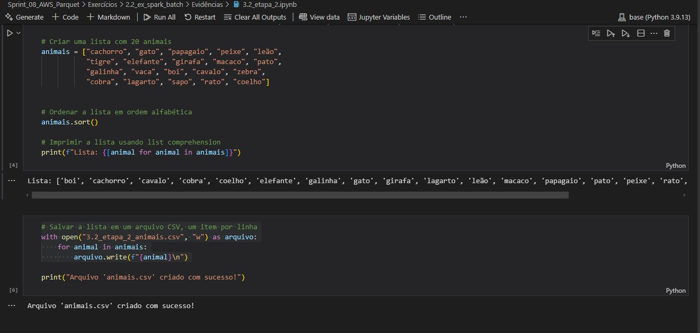
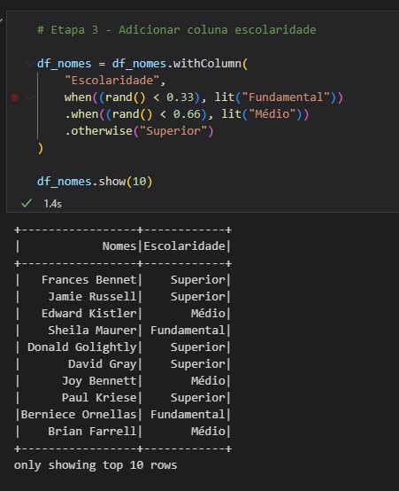
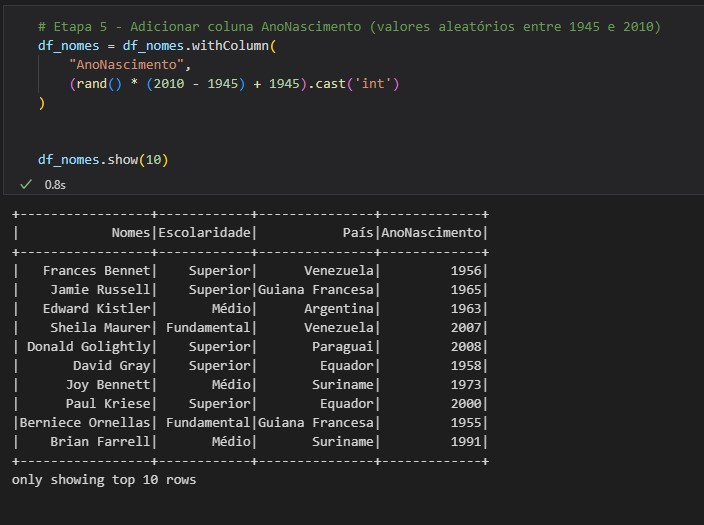

# :hourglass_flowing_sand: Sprint 8 - AWS, Spark e Camada Trusted
:calendar: 20/01 à 03/02/2025

### :writing_hand: Resumo

* Esta sprint foi elaborada para realização do desafio, trabalhando com a camada Trusted e processamento de dados em nuvem.

 

### :trophy: Certificados

Nessa Sprint não houve curso externo, portanto, não há certificado a ser apresentado.

 

### :jigsaw: Desafio

 O objetivo dessa sprint é trabalhar a camada Trusted, transformando o os arquivos da camada Raw em arquivos Parquet para padronização.             
 O relatório do desafio e os arquivos gerados estão no diretório [desafio](./desafio/README.md).

 

### :brain: Exercícios

 

Todos os prints gerados estão disponíveis no diretório [exercicios](./exercicios/) e os seus arquivos de resultados se encontram em [evidencias](./evidencias/evid_exercicios/).

Abaixo relaciono alguns que gostaria de compartilhar.

 

#### 2.2 - Exercício Spark Batch - Geração e massa de dados

Gerar dados para serem processados, via Apache Spark.

 

##### Etapa 1

* Criar uma lista de 250 números inteiros aleatórios, reverter a lista e imprimi-la.                         

              
_*Evidência Ex2.2-1 - Resultado da etapa 1.*_

 

##### Etapa 2

* Trabalhar com uma lista de nomes de 20 animais, ordená-los, salvar em um arquivo CSV e imprimi-los.
                         

              
_*Evidência Ex 2.2-2 - Resultados em código da etapa 2.*_

 

              
_*Evidência Ex 2.2-2 - Resultados da etapa 2 no csv gerado.*_

 

##### Etapa 3

* Gerar um dataset de nomes de pessoas. Deixei como [evidência](./evidencias/evid_exercicios/2.2_ex_spark_batch/3.3_etapa_3.ipynb) o notebook mostrando os resultados de cada passo.

              
_*Evidência Ex 2.2-3 - Resultados da etapa 3 em código.*_

 

              
_*Evidência Ex 2.2-3 - O ``.txt`` foi gerado, e o conteúdo foi bem grande, tanto que tive dificuldades para abri-lo.*_

  

#### 2.2 - Exercício Spark Batch - Geração e massa de dados

* Aplicar recursos básicos de manipulação de DataFrames via Spark.

 

* Etapa 1 - Configurar a sessão Spark e carregar os dados

              
_*Evidência Ex 2.3-1 - Resultado etapa 1.*_

 

* Etapa 2 - Renomear colunas e explorar Schema

              
_*Evidência Ex 2.3-2 - Resultado etapa 2.*_

 

* Etapa 3 - Adicionar coluna escolaridade

              
_*Evidência Ex 2.3-3 - Resultado etapa 3.*_

 

* Etapa 4 - Adicionar coluna país

              
_*Evidência Ex 2.3-4 - Resultado etapa 4.*_

 

* Etapa 5 - Adicionar coluna AnoNascimento (valores aleatórios entre 1945 e 2010)

              
_*Evidência Ex 2.3-5 - Resultado etapa 5.*_

 

* Etapa 6 - Filtrar pessoas nascidas nesse século

              
_*Evidência Ex 2.3-6 - Resultado etapa 6.*_

 

* Etapa 7 - Filtrar pessoas nascidas nesse século usando Spark SQL

              
_*Evidência Ex 2.3-7 - Resultado etapa 7.*_

 

* Etapa 8 - Contar Millennials (1980-1994)

              
_*Evidência Ex 2.3-8 - Resultado etapa 8.*_

 

* Etapa 9 - Contar Millennials (1980-1994) usando Spark SQL

              
_*Evidência Ex 2.3-9 - Resultado etapa 9.*_

 

* Etapa 10 - Contar gerações por país

              
_*Evidência Ex 2.3-10 - Resultado etapa 10.*_

  

#### 5 - Exercício TMDB

Criação de processo de extração de dados da API do TMDB utilizando serviços AWS. O resultado do exercício está na pasta de [exercícios](./exercicios/). 

*_O conteúdo deste exercício foi copiado da Sprint 7, pois são iguais_*

 

* O primeiro passo deste exercício é a criação de conta no TMDB.                         

              
_*Evidência Ex6-1 - Após algumas instruções de configuração o TMDB fornece a chave token que permite as buscas da API.*_

 

* No conteúdo presente na Udemy, nos é apresentado um passo-a-passo para criar um teste utilizando endpoint de filme e, após isso, executarmos o exercício.                         

* Para o meu código, utilizei o endpoint de séries para mostrar os títulos melhores avaliados. Apesar de parecer ser igual ao de séries, é possível analisar no código que algumas colunas não são iguais nos dois tipos.

              
_*Evidência Ex6-2 - Resultado do script que ao final é salvo também em arquivo ``.csv``.*_

  

