# :jigsaw: Desafio - Sprint 8

:calendar: 20/01 à 03/02/2025

 

## :dart: Objetivo

 O desafio dessa sprint é praticar a combinação de conhecimentos vistos no Programa de Bolsas, fazendo um mix de tudo que já foi dito.

 

## :rocket: Desafio Final - Filmes e Séries

O Desafio de Filmes e Séries está dividido em 5 entregas.                           
Trata-se de um desafio para construção de um Data Lake, com as estapas de Ingestão, Armazenamento, Processamento e Consumo.

Nesta Sprint, é preciso explicar os motivadores de utilização de cada API e explicitar as questões que serão respondidas na última etapa do desafio.

_Sigo mantendo minha análise sobre a utilização de crianças em elencos principais em títulos do gênero de terror e mistério_

_Algumas questões que deverão ser respondidas na útima etapa do desafio: Qual a média de idade das crianças? Quais são as que mais participaram de produções do gênero? Qual a classificação indicativa médias para essas produções? Quantas dessas crianças vieram a óbito ainda na infância?_

_Popularmente, o gênero de terror traz algumas crenças, dentre elas a Maldição do Gênero, onde eventos acontecem durante sua produção ou após lançamento, trago o exemplo da atriz Heather O'Rourke de Poltergeist - O Fenômeno. No lançamento do filme, a atriz tinha 07 anos e faleceu aos 12 anos, por um erro médico._

 

## :heavy_check_mark: Etapas - Entrega 3

Obs.: Todas as evidências deste desafio encontram-se no diretório [evidências](../evidencias/evid_desafio/).

 

* [:hammer_and_wrench:   Camada Trusted](#️-camada-trusted)
* [:broom: Jobs AWS Glue](#️-jobs-aws-glue)
* [:building_construction: AWS Glue Crawler e Tables](#️-aws-glue-crawler-e-tables)
* [:owl: AWS Athena](#-aws-athena)

 

### :hammer_and_wrench: Camada Trusted

A camada Trusted de um Data Lake reúne os dados já tratados que vieram da camada RAW. Os dados deverão ser salvos no formato ``.parquet``, particionados por data de ingestão no bucket quando no diretório do TMDB.  O Parquet reduz o tempo de leitura por ser de armazenamento colunar, comprime os dados, diminuindo espaço e reduzindo custos.

  

### :broom: Jobs AWS Glue

* Através de um Job em script Spark, os dados depositados na camada Raw foram tratados e corrigidos quando aplicável e salvos em formato ``parquet`` para mantê-los padronizados.            

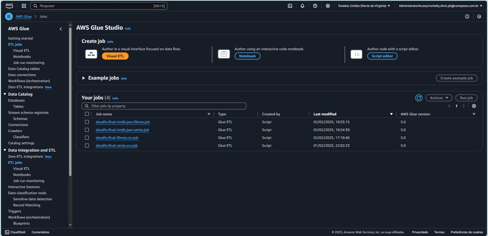                  
_*Evidência 1.0 - Tela do ``ETL jobs``, evidenciando os jobs criados.*_

 

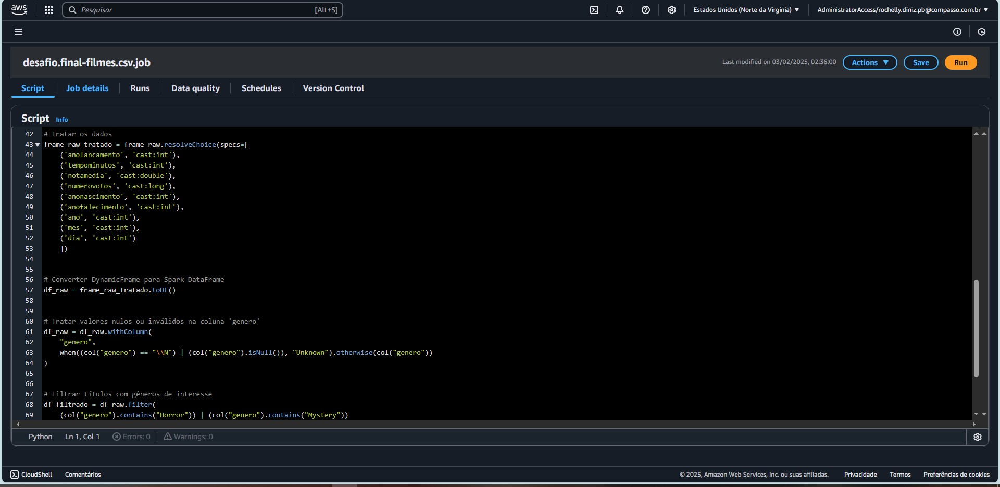                  
_*Evidência 1.1 - Tela do job ``filmes-csv``, evidenciando o bloco de correção dos tipos de dados e valores nulos.*_

 

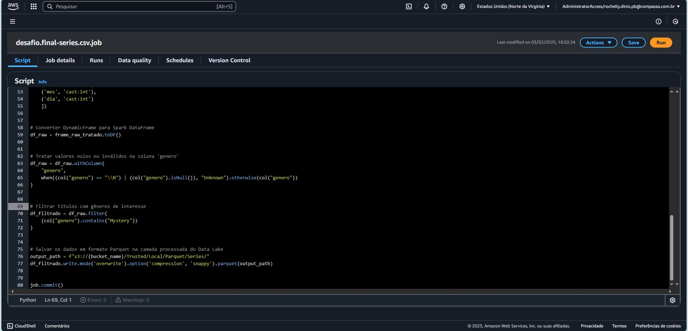                  
_*Evidência 1.2 - Tela do job ``séries-csv``, evidenciando o bloco de tratamento de valores nulos, filtros de gênero e salvamento dos dados.*_

 

                  
_*Evidência 1.3 - Tela do job ``filmes-tmdb``, evidenciando o bloco de tratamento para renomear as colunas.*_

 

                  
_*Evidência 1.4 - Tela do job ``series-tmdb``, evidenciando o bloco de correção dos tipos de dados e salvamento dos dados particionados por ``ano``,``mes``,``dia``.*_

 

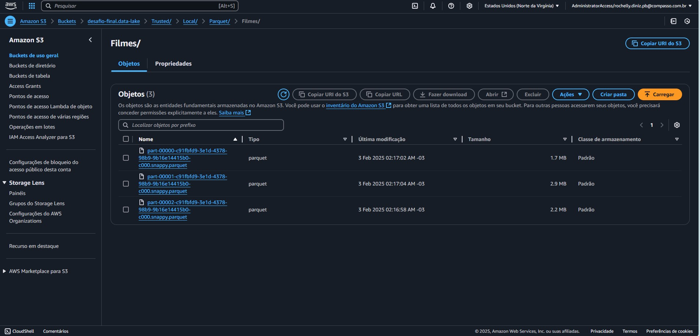                  

_*Evidência 2.1 - Arquivos (antigo ``filmes.csv``) ``.parquet`` gerados após execução do job.*_

 

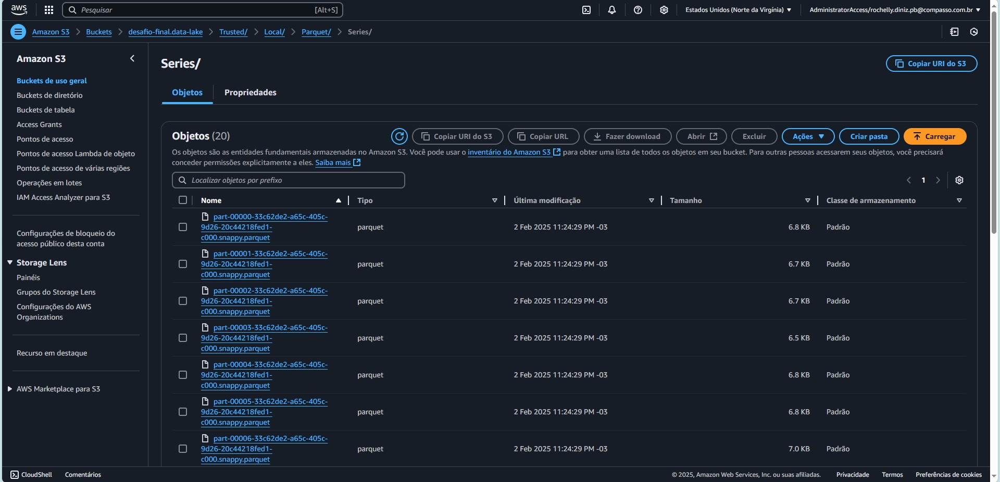                  

_*Evidência 2.2 - Arquivos (antigo ``filmes.csv``) ``.parquet`` gerados após execução do job.*_

 

                  

_*Evidência 2.3 - Arquivos (antigo filmes TMDB Json) ``.parquet`` gerados após execução do job.*_

 

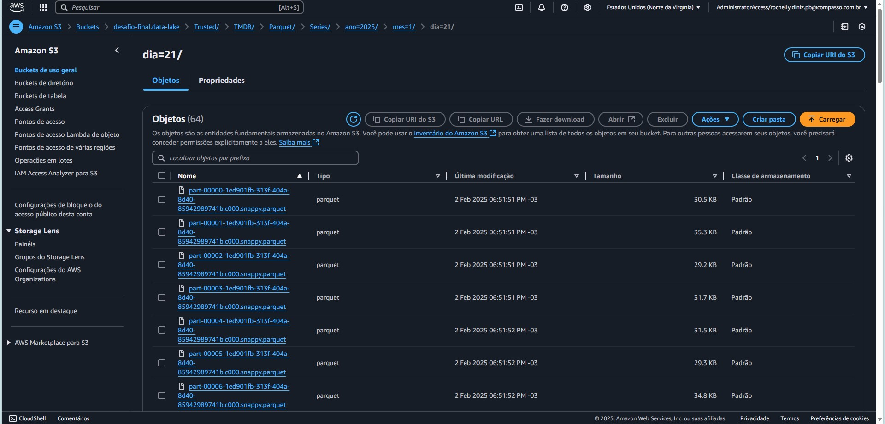                  

_*Evidência 2.4 - Arquivos (antigo séries TMDB Json) ``.parquet`` gerados após execução do job.*_

  

### :building_construction: AWS Glue Crawler e Tables                              

* O Crawler é um serviço do AWS Glue que automatiza a descoberta e catalogação de dados armazenados, neste caso, no S3. Ele identifica Schemas e tipos de dados automaticamente e cria ou atualiza tabelas no Glue Data Catalog.           
Para o caso deste desafio, após padronizarmos os arquivos tratando e transformando-os em formato ``parquet``, foi criado o Crawler para varrer os arquivos da camada ``Trusted``.

 

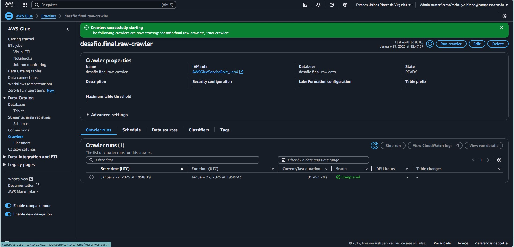                  

_*Evidência 3.1 - Exemplo de ``Crawler`` criado com suas configurações determinadas.*_

 

* Após execução do Crawler, foram verificadas as tabelas criadas.

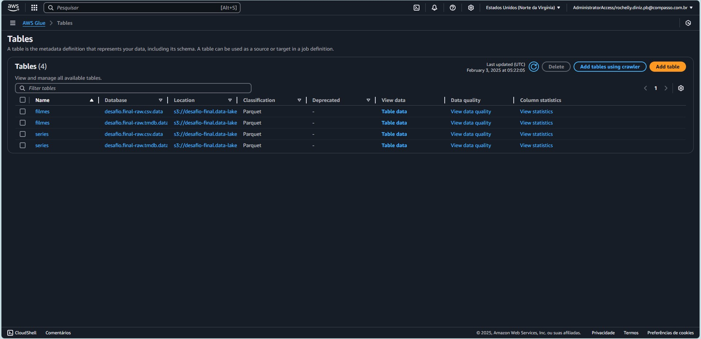                  

_*Evidência 4.0 - Tela ``Tables`` com as tabelas geradas através do ``Crawler``.*_

 

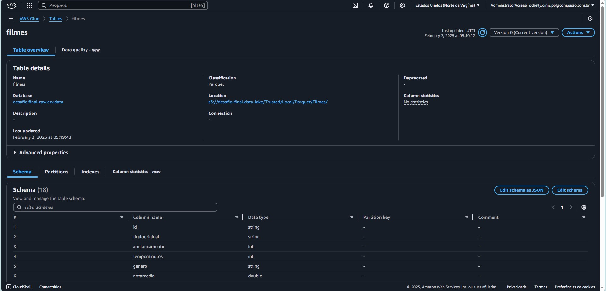                  

_*Evidência 4.1 - Detalhes do Schema ``filmes`` criado na Database ``desafio.final-raw.csv.data``.*_

 

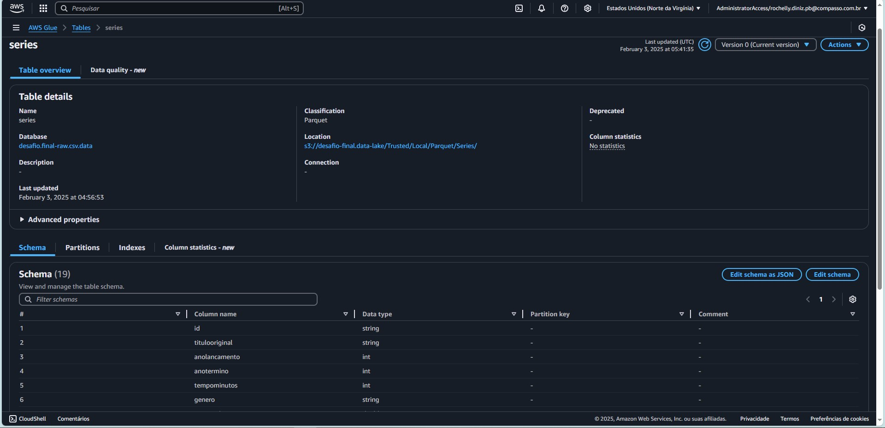                  

_*Evidência 4.2 - Detalhes do Schema ``series`` criado na Database ``desafio.final-raw.csv.data``.*_

 

                  

_*Evidência 4.3 - Detalhes do Schema ``filmes`` criado na Database ``desafio.final-raw.tmdb.data``.*_

 

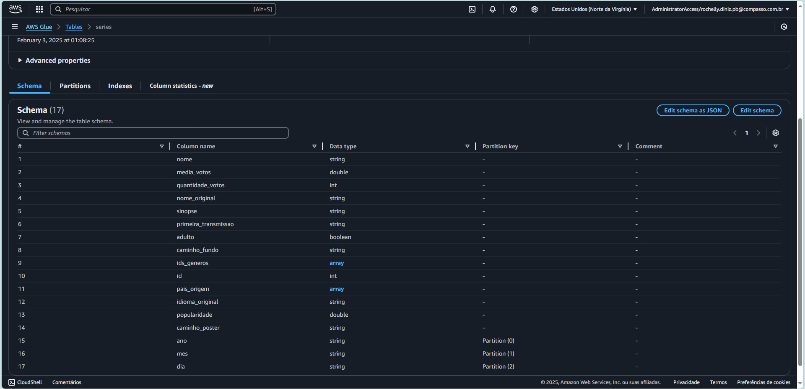                  

_*Evidência 4.4 - Detalhes do Schema ``series`` criado na Database ``desafio.final-raw.tmdb.data``.*_

  

### :owl: AWS Athena

* Para finalizar, foram realizadas ``queries`` no Athena através de código SQL para verificar se os dados das tabelas criadas estão de acordo com o esperado. 

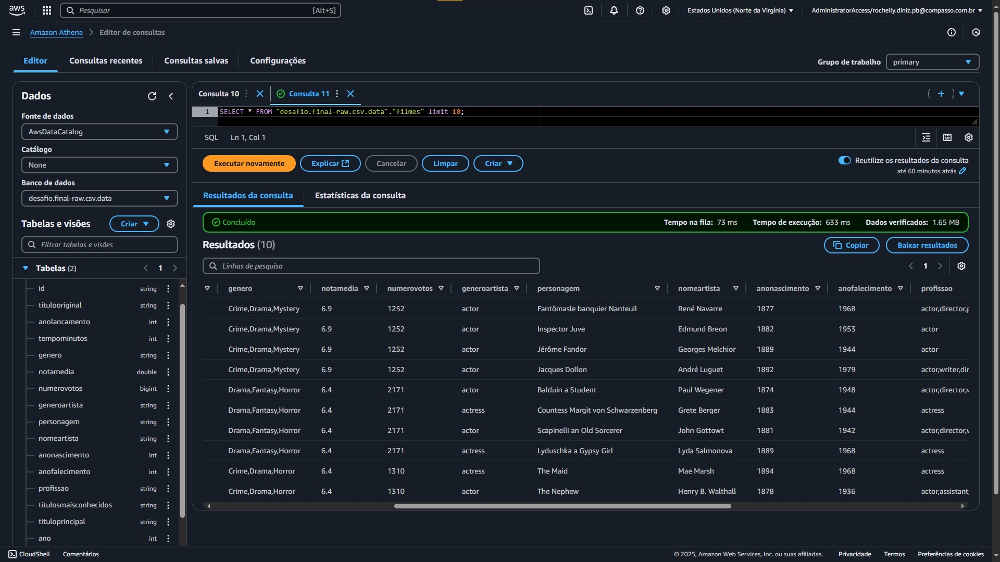                  

_*Evidência 5.1 - Tabela ``filmes.'desafio.final-raw.csv.data'`` criada com sucesso.*_

 

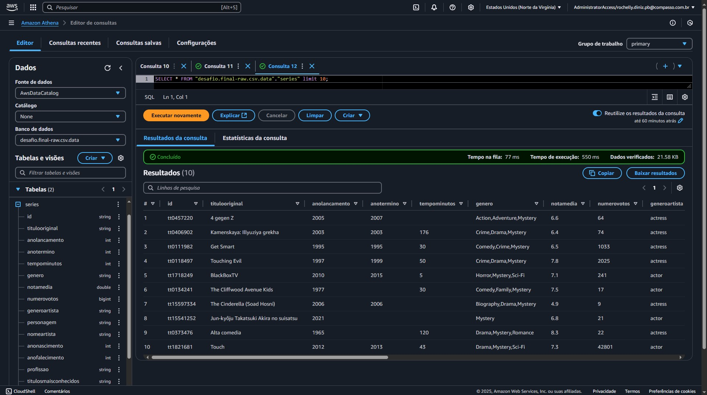                  

_*Evidência 5.2 - Tabela ``series.'desafio.final-raw.csv.data'`` criada com sucesso.*_

 

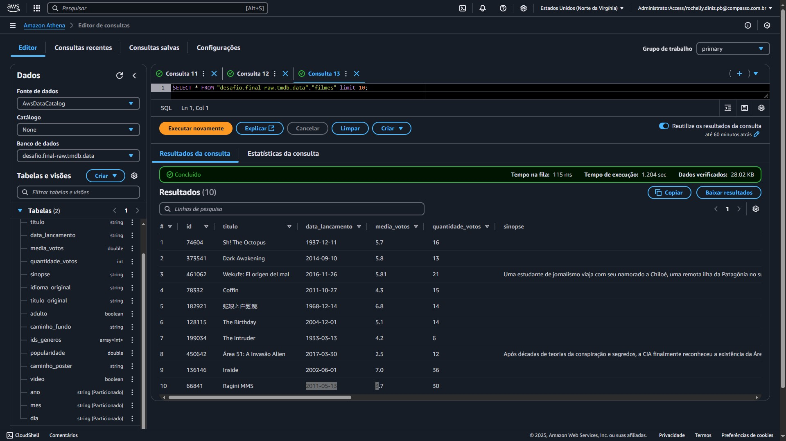                  

_*Evidência 5.3 - Tabela ``filmes.'desafio.final-raw.tmdb.data'`` criada com sucesso.*_

 

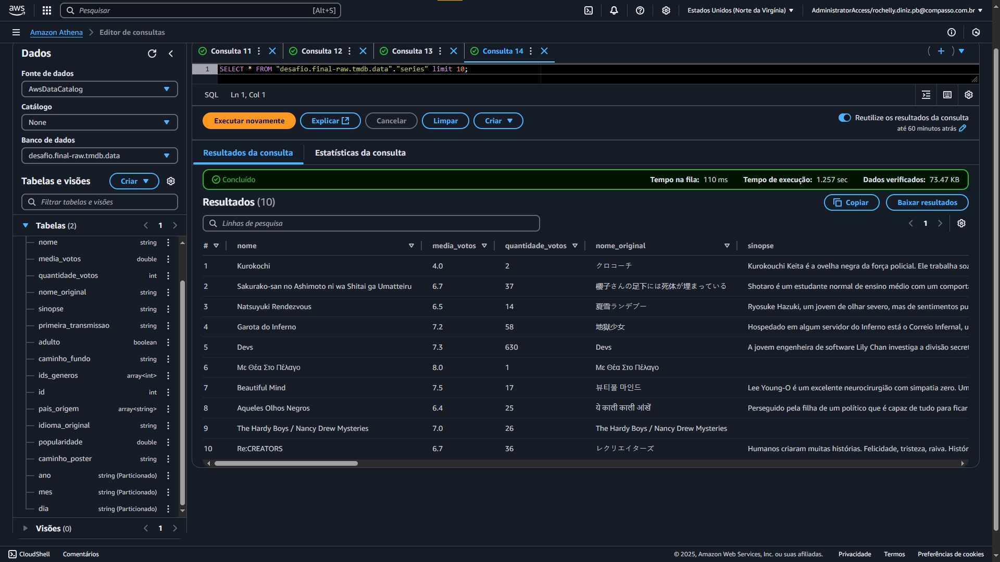                  

_*Evidência 5.4 - Tabela ``series.'desafio.final-raw.tmdb.data'`` criada com sucesso.*_

  

:white_check_mark:
:sun_with_face: