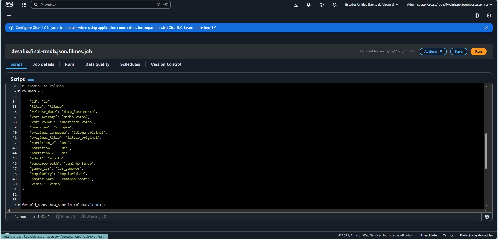

# :jigsaw: Desafio - Sprint 8

:calendar: 20/01 à 03/02/2025

 

## :dart: Objetivo

 O desafio dessa sprint é praticar a combinação de conhecimentos vistos no Programa de Bolsas, fazendo um mix de tudo que já foi dito.

 

## :rocket: Desafio Final - Filmes e Séries

O Desafio de Filmes e Séries está dividido em 5 entregas.                           
Trata-se de um desafio para construção de um Data Lake, com as estapas de Ingestão, Armazenamento, Processamento e Consumo.

Nesta Sprint, é preciso explicar os motivadores de utilização de cada API e explicitar as questões que serão respondidas na última etapa do desafio.

_Sigo mantendo minha análise sobre a utilização de crianças em elencos principais em títulos do gênero de terror e mistério_

_Algumas questões que deverão ser respondidas na útima etapa do desafio: Qual a média de idade das crianças? Quais são as que mais participaram de produções do gênero? Qual a classificação indicativa médias para essas produções? Quantas dessas crianças vieram a óbito ainda na infância?_

_Popularmente, o gênero de terror traz algumas crenças, dentre elas a Maldição do Gênero, onde eventos acontecem durante sua produção ou após lançamento, trago o exemplo da atriz Heather O'Rourke de Poltergeist - O Fenômeno. No lançamento do filme, a atriz tinha 07 anos e faleceu aos 12 anos, por um erro médico._

 

## :heavy_check_mark: Etapas - Entrega 3

Obs.: Todas as evidências deste desafio encontram-se no diretório [evidências](../evidencias/evid_desafio/).

 

* [:clapper:  The Movie Database](#---the-movie-database)
* [:closed_lock_with_key: Ingestão de API](#-ingestão-de-api)
* [:file_folder: Criação da Layer](#-criação-da-layer)

 

### ::   Camada Trusted

A camada Trusted de um Data Lake reúne os dados já tratados que vieram da camada RAW. Os dados deverão ser salvos no formato ``.parquet``, particionados por data de ingestão no bucket quando no diretório do TMDB.  O Parquet reduz o tempo de leitura por ser de armazenamento colunar, comprime os dados, diminuindo espaço e reduzindo custos.

  

### :: Jobs AWS Glue

* Através de um Job em script Spark, os dados depositados na camada Raw foram tratados e corrigidos quando aplicável e salvos em formato parquet para mantê-los padronizados.            

                  

_* Evidência 1.1 - Tela do job ``filmes-csv``, evidenciando o bloco de correção dos tipos de dados e valores nulos.*_

 

                  

_* Evidência 1.2 - Tela do job ``séries-csv``, evidenciando o bloco de tratamento de valores nulos, filtros de gênero e salvamento dos dados.*_

 

                  

_* Evidência 1.1 - Tela do job ``filmes-tmdb``, evidenciando o bloco de tratamento para renomear as colunas.*_

 

                  

_* Evidência 1.1 - Tela do job ``series-tmdb``, evidenciando o bloco de correção dos tipos de dados e salvamento dos dados particionados por ``ano``,``mes``,``dia``.*_

 

  

